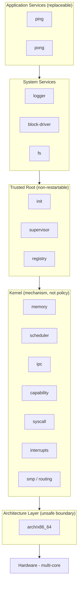
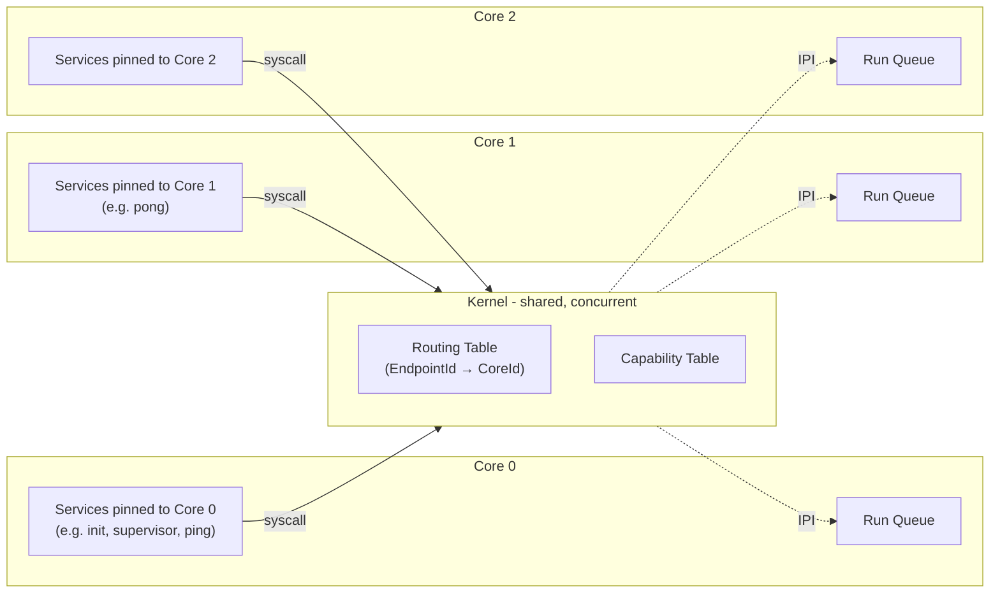
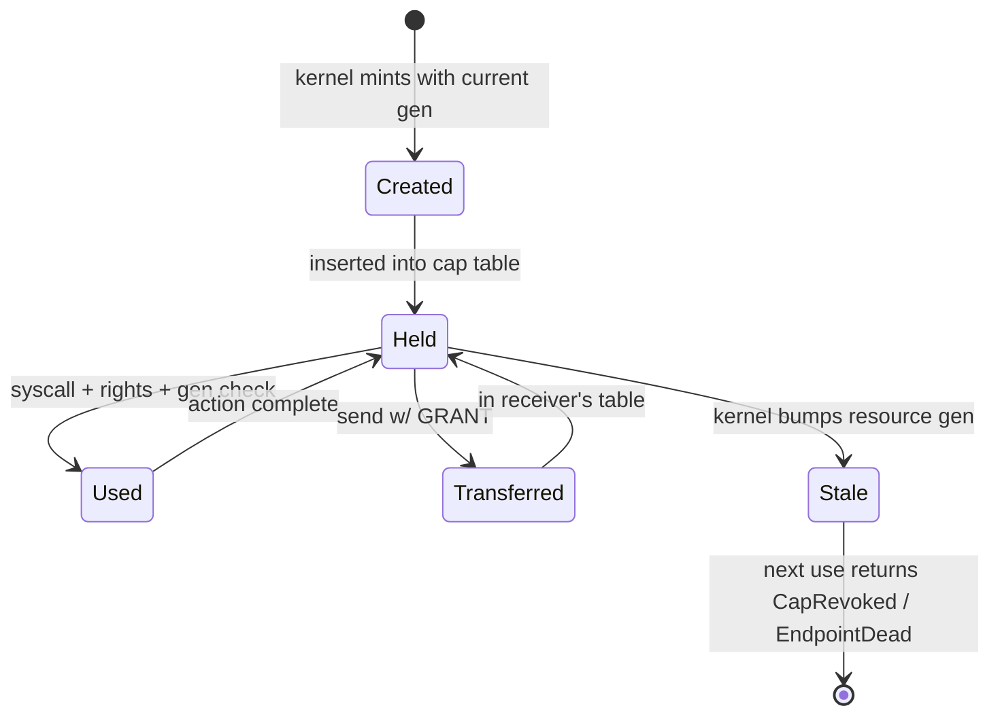
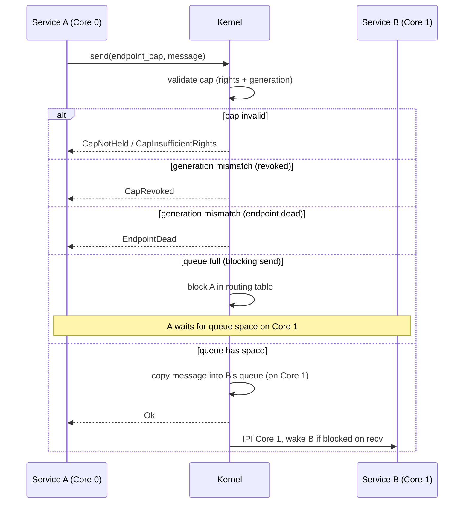
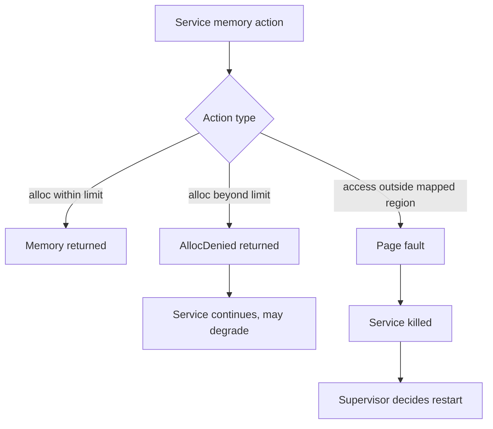
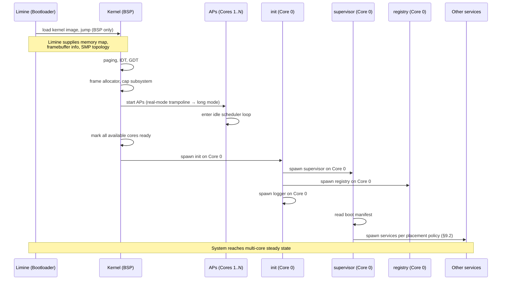
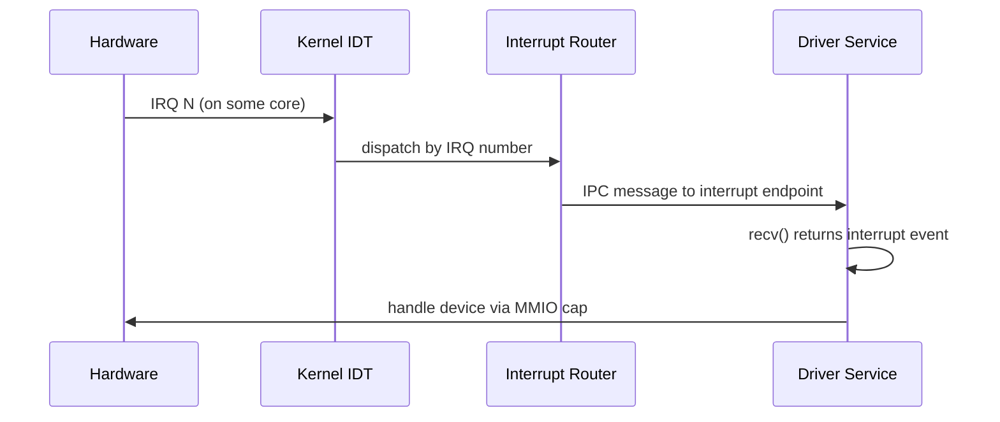
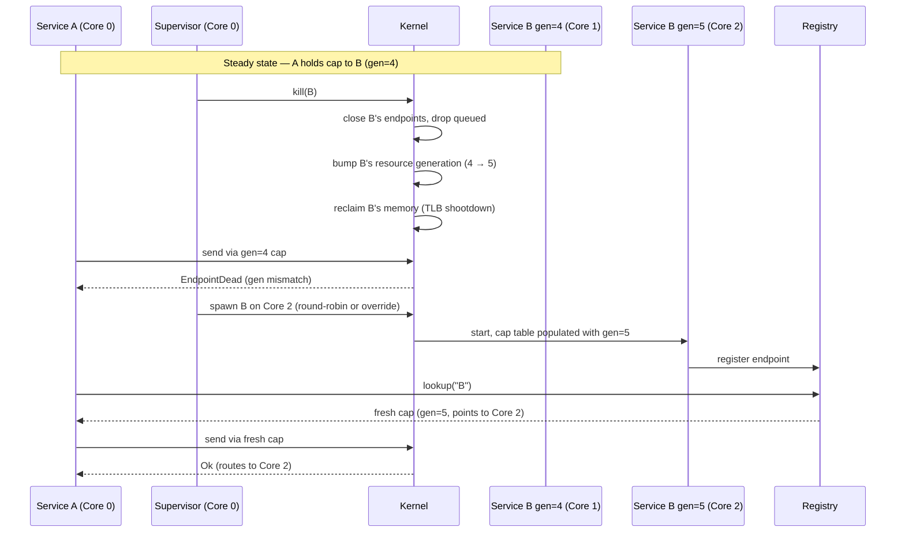
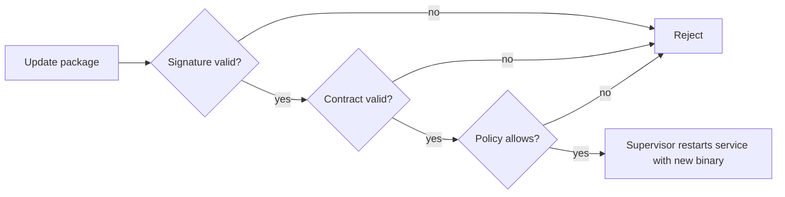
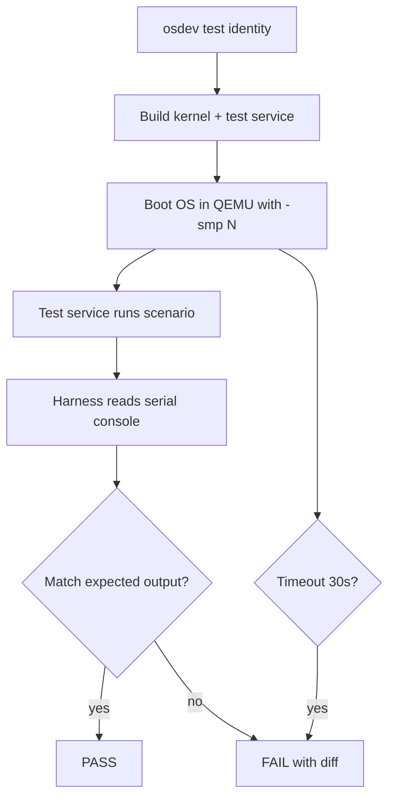

# CLAUDE.md
## Capability-Based Microkernel OS

**Status:** v3.7 — SMP-Integrated Spec, Reviewed, with Forward-Looking Appendices
**Scope:** v1 milestone (multi-core kernel, two services, cross-core IPC, supervisor restart with core reassignment)
**Audience:** Contributors, reviewers, future maintainers

---

## Table of Contents

1. [Purpose of This Document](#1-purpose-of-this-document)
2. [Project Identity](#2-project-identity)
3. [Constitution: Non-Negotiable Invariants](#3-constitution-non-negotiable-invariants)
4. [Architecture Overview](#4-architecture-overview)
5. [Repository Structure](#5-repository-structure)
6. [Trusted Computing Base](#6-trusted-computing-base)
7. [Capability System](#7-capability-system)
8. [IPC](#8-ipc)
9. [Scheduler and SMP](#9-scheduler-and-smp)
10. [Memory Model](#10-memory-model)
11. [Bootstrap Sequence](#11-bootstrap-sequence)
12. [Drivers and Interrupts](#12-drivers-and-interrupts)
13. [Service Contracts](#13-service-contracts)
14. [Service Lifecycle](#14-service-lifecycle)
15. [State and Persistence](#15-state-and-persistence)
16. [Update Model](#16-update-model)
17. [Developer Workflow](#17-developer-workflow)
18. [Unsafe Policy](#18-unsafe-policy)
19. [Debugging Model](#19-debugging-model)
20. [Performance Philosophy](#20-performance-philosophy)
21. [Contribution Rules](#21-contribution-rules)
22. [Identity Test Suite](#22-identity-test-suite)
23. [First Milestone](#23-first-milestone)
24. [Glossary](#24-glossary)
25. [Final Principles](#25-final-principles)

**Appendices (forward-looking, mostly non-normative):**

- [Appendix A: Bootloader Choice (Limine)](#appendix-a-bootloader-choice-limine)
- [Appendix B: Userspace Posture](#appendix-b-userspace-posture)
- [Appendix C: Forward-Looking Vision (Non-Normative)](#appendix-c-forward-looking-vision-non-normative)
- [Appendix D: Shell, Scripting, and Utility Ecosystem (Non-Normative, Far Future)](#appendix-d-shell-scripting-and-utility-ecosystem-non-normative-far-future)

---

## 1. Purpose of This Document

This document is the constitution of the project. It defines the enforceable laws and concrete decisions of the OS.

It is **not aspirational**. It is a commitment to specific trade-offs.

It exists to:

- Ensure the system remains small, correct, and enforceable.
- Prevent contributors from introducing hidden complexity.
- Make every architectural decision traceable to a stated rationale.
- Resolve future arguments by appeal to written law rather than memory.

When this document and the code disagree, the document wins and the code is wrong. When this document and reality disagree, the document is amended and the change is recorded.

The appendices at the end of this document collect forward-looking design notes. Appendix A documents a v1 commitment (the bootloader choice). Appendices B, C, and D are explicitly non-normative — they record design intent and discussion, not commitments. Their content does not amend the constitution.

---

## 2. Project Identity

### 2.1 What This Project Is

A deliberately small, fully-understood capability microkernel, built to internalize the design discipline of capability-based systems by writing one.

### 2.2 What This Project Is Not

- A novel research system.
- A POSIX-compatible OS.
- A production-grade kernel.
- A general-purpose application platform.
- A competitor to seL4, Fuchsia, Hubris, Redox, or Genode.

### 2.3 Goals, Ranked

1. **Clarity over novelty.** Every part of the system should be explainable in a paragraph.
2. **Correctness over cleverness.** A boring, verifiable design beats a clever, fragile one.
3. **Execution over theory.** Shipping a working ping/pong beats refining a perfect spec.

### 2.4 v1 Architectural Principles

- Isolation over performance.
- Explicit transitions over implicit mutation.
- Identity over location.
- Simplicity over cleverness.
- **Loud failures over silent fallbacks.**

### 2.5 v1 Permanent Decisions

| Capability         | Status                  | Rationale                                       |
|--------------------|-------------------------|-------------------------------------------------|
| SMP                | **Supported (static)**  | Cross-core parallelism; no migration            |
| Zero-copy IPC      | **Rejected, permanent** | Violates "no shared mutable memory"             |
| Live code updates  | **Rejected, permanent** | Restart-with-reacquisition is sufficient        |

### 2.6 Reference Systems

| System  | What we borrow                                          |
|---------|---------------------------------------------------------|
| seL4    | Capability model, synchronous IPC discipline             |
| Hubris  | Declarative task contracts, supervisor-driven restart    |
| Fuchsia | Userspace drivers, capability handles in IPC messages    |
| Genode  | Composition through capability delegation                |
| Redox   | Rust microkernel patterns                                |

---

## 3. Constitution: Non-Negotiable Invariants

These are the laws that bound every design choice. Any change that violates an invariant must first amend the invariant — and amendments require a written rationale.

1. **No ambient authority.** Every privileged action requires an explicit capability.
2. **No shared mutable memory by default.** Services have isolated address spaces.
3. **All authority is explicit.** Capabilities, not identity.
4. **Kernel remains tiny.** Memory, scheduling, IPC, capabilities, interrupts, cross-core routing. Nothing else.
5. **Unsafe is isolated and audited.** Permitted only in `arch/`, `memory/`, `capability/`, `smp/`.
6. **Services must be restartable** (with stated TCB exceptions).
7. **Contracts are enforced, not interpreted.**
8. **State must be explicit and owned.** No anonymous singletons.
9. **No unowned global mutable state.** Immutable globals are fine.
10. **System must remain understandable.** 30-minute whiteboard rule.
11. **Identity is stable; location is not.** Services have stable names; their core assignment may change across restarts.
12. **Failures are loud, never silent.** No silent fallbacks at the kernel boundary.

---

## 4. Architecture Overview

### 4.1 Layered View



### 4.2 SMP View (Per-Core)



### 4.3 Kernel Scope (Strict)

- Memory isolation (per-service address spaces, page tables)
- Scheduling (per-core run queues, round-robin with timer preemption)
- IPC (synchronous message passing, bounded queues, cross-core routing)
- Capability enforcement (validation on every privileged syscall, generation check)
- Interrupt routing (delivery to userspace driver services)
- SMP routing (EndpointId → CoreId map, IPI wakeup)

### 4.4 Kernel Anti-Scope

The kernel does **not** contain filesystem logic, network stack, drivers (beyond minimal arch boot), logging infrastructure, application logic, developer tooling, work-stealing scheduler, service migration, or load balancing.

---

## 5. Repository Structure

```
os/
  CLAUDE.md
  README.md
  Cargo.toml

  kernel/
    src/
      main.rs
      arch/x86_64/         # boot.rs, interrupts.rs, context_switch.rs, page_tables.rs, ap_boot.rs
      memory/              # frame.rs, page.rs, allocator.rs, ownership.rs
      task/                # task.rs, state.rs, scheduler.rs (per-core)
      ipc/                 # message.rs, endpoint.rs, queue.rs, routing.rs
      capability/          # cap.rs, table.rs, rights.rs, generation.rs, revoke.rs
      smp/                 # core.rs, ipi.rs, placement.rs
      syscall/dispatch.rs
      interrupt/route.rs
      invariants/assertions.rs
      log.rs               # kernel ring buffer

  services/
    init/                  # PID 1 equivalent (TCB)
    supervisor/            # restart authority (TCB)
    registry/              # name → endpoint resolution (TCB)
    logger/
    block-driver/          # v1: trusted
    fs/                    # v1: trusted, depends on block-driver

  sdk/rust/                # service_context.rs, capability.rs, ipc.rs

  osdev/
    src/main.rs
    src/validator.rs       # JSON Schema validation

  examples/
    ping/
    pong/

  contracts/
    schema/service.schema.json

  docs/
    bootstrap.md
    ipc.md
    capability.md
    restart.md
    smp.md
    bootloader.md          # Limine integration notes
    unsafe-audit.md

  tests/
    qemu/
      identity/            # identity test suite (§22)
      harness/             # shared test infrastructure
      perf/                # deferred
```

---

## 6. Trusted Computing Base

### 6.1 TCB Members

| Component         | Trusted because                                     |
|-------------------|-----------------------------------------------------|
| Kernel            | Enforces all isolation                              |
| `arch/x86_64`     | Direct hardware access                              |
| `kernel/smp`      | Concurrent-correctness primitives                   |
| `init` service    | Spawns supervisor; first userspace authority        |
| `supervisor`      | Holds restart authority over all other services     |
| `registry`        | Without it, caps cannot be reacquired post-restart  |
| `block-driver`    | (v1 only) FS depends on it; restart loses disk state |
| `fs`              | (v1 only) Owns persistent state for the system      |

### 6.2 Failure Semantics

> **Failure of any TCB service (`init`, `supervisor`, `registry`, `block-driver`, `fs`) results in kernel panic and immediate system reboot. No automatic recovery is attempted in v1.**

> **Failure on any core that corrupts shared kernel state (capability table, routing table) results in kernel panic on all cores.**

Silent recovery of TCB state risks undefined system state. Loud failure plus clean restart is the only safe v1 option.

### 6.3 Reducing TCB Over Time

The block-driver and FS being trusted is a v1 simplification. v2 goal: only `init`, `supervisor`, `registry`, and the kernel remain non-restartable.

---

## 7. Capability System

### 7.1 Concept

A capability is an unforgeable token granting specific rights to a specific resource at a specific generation. Holding a cap is necessary and sufficient authority for the actions it permits — provided its generation still matches the kernel's record.

### 7.2 Capability Structure

```
Capability = ResourceId + Rights + Generation
```

- **ResourceId** — identifies the target resource (endpoint, memory region, MMIO range).
- **Rights** — bitfield of permitted actions (READ, WRITE, SEND, RECV, GRANT, REVOKE).
- **Generation** — monotonic counter assigned by the kernel when the resource is created or replaced.

### 7.3 Properties

- **Unforgeable.** Only the kernel constructs valid capabilities.
- **Explicit.** Authority comes from holding a cap, not from identity.
- **Non-escalating.** Rights cannot be widened.
- **Scoped.** Targets a specific resource, not a class.
- **Revocable.** Kernel can invalidate at any time.
- **Transferable** (with `GRANT` right).
- **Generationed.** Stale caps fail their generation check on use.

### 7.4 Rights Model

| Right      | Meaning                                              |
|------------|------------------------------------------------------|
| `READ`     | Read from a resource                                 |
| `WRITE`    | Write to a resource                                  |
| `SEND`     | Send messages to an IPC endpoint                     |
| `RECV`     | Receive messages from an IPC endpoint                |
| `GRANT`    | Transfer this capability via IPC                     |
| `REVOKE`   | Revoke this capability (held by supervisor only)     |

### 7.5 Generations

Every capability carries a generation number. Every resource in the kernel tracks its current generation.

**Bumping rules:**

- **Restartable / destroyable resources** bump their generation when they are destroyed or replaced. This invalidates all outstanding caps targeting them.
- **Stable resources** (kernel-owned, never reclaimed) keep generation 0 forever.

**Validation on use:**

```
syscall(cap, action, args):
    if cap.resource_id not in kernel_table:
        return CapNotHeld
    if cap.generation != kernel_table[cap.resource_id].generation:
        return CapRevoked or EndpointDead   # depending on cause
    if action not in cap.rights:
        return CapInsufficientRights
    perform action
```

The generation check is one atomic comparison. It is the v1 mechanism for cross-core revocation: bumping the generation on one core makes every cap on every other core stale, with no synchronous notification required.

### 7.6 Lifecycle



### 7.7 Error Codes

Both error codes are kept; they share a mechanism but communicate different intent:

| Error                    | Meaning                                              |
|--------------------------|------------------------------------------------------|
| `CapNotHeld`             | Cap not in calling task's table                      |
| `CapInsufficientRights`  | Cap held but lacks required right                    |
| `CapNotGrantable`        | Send embedded a cap without GRANT                    |
| `CapWrongScope`          | Cap targets a different resource than the action     |
| `CapRevoked`             | Authority explicitly invalidated                     |
| `EndpointDead`           | Endpoint/service lifecycle terminated                |

Same generation-mismatch mechanism underlies `CapRevoked` and `EndpointDead`; the kernel returns the more specific code based on whether the resource was destroyed (endpoint dead) or had its cap explicitly revoked.

### 7.8 Capability Table Concurrency

Multiple cores may execute syscalls touching the same capability table simultaneously. v1 uses a locking discipline that guarantees:

- Reads (cap lookup, generation check) are wait-free under common cases.
- Writes (cap insertion on spawn, removal on death) are serialized.
- A revocation in flight on one core is visible to a syscall in flight on another core within bounded time (next memory barrier).

The exact primitive is an implementation choice, not a spec choice.

> **v1 implementation note:** A single global `RwLock` is acceptable for the v1 milestone. Syscall-path serialization is a known performance cost; sharded or RCU-based designs are explicit v2 work and require benchmarks before adoption.

### 7.9 Example

```rust
fn main(ctx: ServiceContext) -> Result<()> {
    let logger    = ctx.capability("log_write")?;
    let pong_send = ctx.capability("ipc_send.pong")?;

    logger.info("ping starting")?;
    pong_send.send(Message::text("hello"))?;
    Ok(())
}
```

---

## 8. IPC

### 8.1 Model

Synchronous message passing with bounded per-endpoint queues. Endpoints are owned by services; services are pinned to cores; sending across cores goes through the kernel routing table.

### 8.2 Syscalls

```rust
send(endpoint_cap, message)     -> Result<(), IpcError>   // blocks if full
recv(endpoint_cap)              -> Result<Message, IpcError>  // blocks until msg
try_send(endpoint_cap, message) -> Result<(), IpcError>   // non-blocking
```

### 8.3 Routing

The kernel maintains a routing table:

```
EndpointId → (CoreId, Generation, Liveness)
```

On every send, the kernel:

1. Validates the cap (rights + generation).
2. Looks up the target endpoint in the routing table.
3. Enqueues into the target endpoint's queue (which lives on the target's core).
4. If the receiver is blocked on `recv`, sends an IPI to its core to wake it.

### 8.4 Send Flow



### 8.5 Message and Queue Format

- **Maximum message size:** 4 KiB (one page).
- **Queue depth:** **16 messages per endpoint, fixed in v1.** Worst-case 64 KiB per endpoint queue.
- **Copy semantics:** kernel copies sender → receiver. Zero-copy is permanently rejected (§2.5).
- **Embedded capabilities:** caps inside a message are transferred (with `GRANT`) and removed from sender's table.

Queue depth is not configurable per endpoint in v1. Per-endpoint depth is a v2 concern.

### 8.6 Failure Semantics

| Event                                       | Effect                       |
|---------------------------------------------|------------------------------|
| Service dies                                | Endpoint generation bumped; queue drained |
| `send` to closed endpoint                   | Returns `EndpointDead`       |
| `recv` on closed endpoint                   | Returns `EndpointDead`       |
| Sender already blocked when endpoint closes | Wakes with `EndpointDead` (cross-core IPI) |
| Send-during-restart race                    | Generation check catches it; returns `EndpointDead` |

> **No delivery guarantee.** A successful `send` means the message was queued, not processed. Protocols requiring acknowledgment must build it explicitly.

### 8.7 Send-During-Restart Race

Without explicit handling, this race is real:

- Core 0: A reads cap to B (generation 4, alive).
- Core 1: B is killed, generation bumped to 5.
- Core 0: A's send syscall executes.

Resolution: the kernel checks A's cap generation against the routing table's current generation atomically inside the send syscall. The generation has been bumped to 5; A's cap is generation 4; send returns `EndpointDead`. The race is invisible to the developer.

### 8.8 Cross-Core IPC Cost

Cross-core sends pay one IPI to wake a blocked receiver, one memory barrier on enqueue, and cache-line bouncing on the queue's head/tail indices. These are real costs but they are bounded and predictable. v1 does not optimize cross-core IPC beyond getting it correct.

### 8.9 Deadlock and Mutual-Blocking Avoidance

The kernel does not detect or break deadlocks.

> **Design rule:** In any protocol where A and B both send to each other, at least one direction MUST use `try_send`. Mutual blocking sends are an anti-pattern the kernel will not detect and will not recover from. The supervisor's quantum-starvation watchdog is a last resort, not a primary mitigation.

The classic deadlock — A and B both call `send` to a full queue — is the developer's responsibility to prevent at the protocol level. Use `try_send`, structure as request/response, or apply explicit timeouts.

---

## 9. Scheduler and SMP

### 9.1 Model

- **Multi-core in v1.** Number of cores discovered at boot.
- **Per-core run queues.** Each core runs round-robin over its own queue.
- **Static placement.** Services are pinned at spawn; they never migrate.
- **10 ms preemption quantum**, per core, enforced by each core's local timer.

### 9.2 Placement (Strict)

When the supervisor spawns a service:

```
1. If the contract specifies [placement] core = N:
   - If core N exists and is ready, spawn on N.
   - Otherwise, spawn rejected with PlacementInvalid.
     The supervisor logs the rejection and skips the service.
     The system continues with the services that did start.
2. If no placement specified:
   - Round-robin across ready cores.
3. Once placed, the service stays on that core for its lifetime.
```

> **Rationale (strict):** Contracts are enforced, not interpreted (§3.7). A contract that names a core means the developer expressed deployment intent. Silently rerouting to a different core would be exactly the kind of reinterpretation a capability-based system is designed to forbid. Contracted placement is deployment-coupled by design.

**On restart:** the placement decision is re-evaluated from scratch using the rules above. The supervisor does not remember the previous core.

- If the contract specified a core, that core is required again. If it is unavailable, the restart fails with `PlacementInvalid` — the same strict rule as initial spawn.
- If the contract did not specify a core, round-robin selects a fresh core, which may differ from the previous one.

This is consistent with invariant 11 (identity is stable; location is not). Sticky placement would make location stable across restart, contradicting the principle. Mid-execution migration remains forbidden.

### 9.3 Yield

```rust
yield() -> ()
```

Yield is **advisory**. Preemption remains enforced regardless. The scheduler does not rely on cooperative behavior for correctness or fairness.

### 9.4 Cross-Core Wakeups

When a syscall on core 0 needs to wake a task on core 1 (e.g., `send` woke a blocked `recv`), the kernel sends an IPI to core 1. The receiving core's IPI handler re-enters the scheduler.

### 9.5 What v1 Does Not Have

- Work stealing
- Load balancing
- Priority scheduling
- Service migration
- Core hotplug (cores discovered at boot are fixed for system lifetime)

---

## 10. Memory Model

### 10.1 Isolation

Each service has a separate virtual address space established at spawn time via per-task page tables.

### 10.2 Limits

```toml
[resources.memory]
request = "32MiB"   # minimum needed to start
limit   = "64MiB"   # maximum permitted
```

### 10.3 Enforcement



### 10.4 Two Failure Modes

`AllocDenied` is **recoverable**. The service knows it asked for too much and can degrade.

A protection violation is **unrecoverable**. The service is in undefined state and the only safe response is termination.

### 10.5 TLB Coherence

When a page is unmapped (service killed, memory reclaimed), the kernel issues a TLB shootdown via IPI to every core. Operations resume only after acknowledgment from all cores. v1 minimizes unmap frequency by reclaiming memory only at service death.

---

## 11. Bootstrap Sequence

### 11.1 Sequence



The bootloader is **Limine**, accessed via the Limine Boot Protocol. Limine is responsible for loading the kernel image, supplying the physical memory map, the framebuffer descriptor, kernel relocation info, and the SMP topology (APIC IDs of all available cores). See Appendix A for the bootloader rationale and installation story.

### 11.2 BSP and APs

- **BSP (Bootstrap Processor)** — the first core to execute kernel code. Responsible for kernel init and bringing APs online.
- **APs (Application Processors)** — secondary cores. Brought up via real-mode trampoline (`arch/x86_64/ap_boot.rs`), then jump to long-mode kernel code, then enter idle.

Because Limine supplies APIC IDs directly, the kernel does not need to probe ACPI/MADT for SMP topology. This removes a non-trivial subsystem from `arch/x86_64/ap_boot.rs`.

### 11.3 Failure During Bootstrap

| Failing component | Effect                                |
|-------------------|---------------------------------------|
| Bootloader        | Hardware reset                         |
| Kernel BSP init   | Kernel panic, halt                     |
| AP startup        | Kernel logs warning, continues with available cores; if zero APs come up, system runs as single-core |
| init spawn        | Kernel panic, halt                     |
| supervisor spawn  | Kernel panic, halt (TCB)               |
| registry spawn    | Kernel panic, halt (TCB)               |
| logger spawn      | Init logs to kernel ring buffer, retry |
| Application svc   | Supervisor logs, may retry per policy  |
| Service contracted to unavailable core | Spawn rejected with `PlacementInvalid`; supervisor logs and skips; system runs without that service |

### 11.4 Logging Before Logger Exists

The kernel maintains a 16 KiB ring buffer (per-core view, single shared sink). Anything logged before the logger is up writes to the ring buffer and the serial console. When the logger starts, it drains the buffer.

---

## 12. Drivers and Interrupts

### 12.1 Model

Kernel routes interrupts. Drivers are user-space services. Essential drivers (block-driver) are trusted in v1.

### 12.2 Routing



If the driver runs on a different core than the one receiving the IRQ, routing crosses cores via the same IPC mechanism as any other cross-core send.

### 12.3 Driver Capabilities

```toml
[capabilities]
hw_interrupt = [12]                       # IRQ line
hw_mmio      = ["0xfee00000+0x1000"]      # MMIO region
```

The kernel validates these at spawn time and grants caps only for the specified resources.

---

## 13. Service Contracts

### 13.1 Format

```toml
name    = "ping"
version = "0.1.0"

[resources.memory]
request = "32MiB"
limit   = "64MiB"

[capabilities]
ipc_send    = ["pong"]
ipc_receive = ["ping"]
log_write   = true

[placement]
core = 0    # optional; if omitted, supervisor uses round-robin
```

### 13.2 Placement Field (Strict)

- **Omitted** → supervisor places via round-robin across available cores.
- **Specified** → supervisor requires that exact core. If unavailable, spawn is rejected with `PlacementInvalid`.

> **Strict semantics:** A contract that names a core is a deployment-intent statement. The supervisor will not silently reroute to a different core. If `placement.core = 2` and core 2 didn't come up, the service does not start; the supervisor logs the rejection and continues. Contract authors should specify placement only when they have a real reason.

### 13.3 Request, Not Permission

The developer declares **what the service needs**. The OS decides **whether to grant it**.

### 13.4 Build-Time Validation

`osdev` validates contracts using JSON Schema applied to the TOML structure.

**Guarantees:** correct structure, valid capability names, valid resource declarations, valid core IDs (range check only), required fields present.

**Non-guarantees:** behavioral correctness, that the binary uses only declared caps, that limits are reasonable, that the requested core will be available at spawn time.

> Build-time validation is structural, not behavioral. Behavioral enforcement is runtime-only in v1.

### 13.5 Schema

`contracts/schema/service.schema.json`. Versioned. Breaking changes require a major version bump and a documented migration.

### 13.6 Runtime Enforcement

Every syscall checks the calling task's capability table, populated *from* the contract at spawn time. The kernel does not consult the contract at runtime.

---

## 14. Service Lifecycle

### 14.1 Spawn

1. Supervisor reads service binary + contract.
2. Validates contract against schema.
3. Determines core placement (round-robin or contract override per §9.2; rejected if contracted core unavailable).
4. Asks kernel to create a new task on that core with declared resources.
5. Kernel mints capabilities per contract (each tagged with current resource generation).
6. Kernel maps service binary into new address space.
7. Service registers any owned endpoints with registry.
8. Service enters main loop on its assigned core.

### 14.2 Restart and Cap Rebinding (Possibly Cross-Core)



**Key principle:** the new instance may run on a different core than the old one. Clients never know — they see only `EndpointDead`, look up via registry, and resume.

### 14.3 Cascading Failure

Cascading failure is **the client's responsibility**. There is no implicit recovery. If A depends on B and B restarts, A's next syscall returns `CapRevoked` or `EndpointDead`, and A must retry, degrade, or fail.

### 14.4 Supervisor API

```rust
supervisor.kill(service_name) -> Result<()>
supervisor.restart(service_name, placement_override?: CoreId) -> Result<()>
```

Required capability: `service_control` (held only by supervisor).

- **`kill`** — immediate. The killed service does not get a chance to clean up. Clean shutdown is a separate codepath.
- **`restart`** — kill followed by spawn. Placement is determined as follows:
  - If `placement_override` is provided, the supervisor requires that core (subject to the strict rules of §9.2; rejected if the core is unavailable).
  - If `placement_override` is omitted, the placement decision is re-evaluated from scratch per §9.2 — contract-specified placement re-applies (and may fail with `PlacementInvalid` if unavailable); unspecified placement gets a fresh round-robin choice.
  - **The previous core is not remembered.** A service that ran on core 1 before the restart has no implicit affinity for core 1 after.

### 14.5 Kill Semantics

Kill is for misbehaving services and for restart. It is not a graceful shutdown mechanism.

---

## 15. State and Persistence

State belongs to services, not the kernel. Services that need to survive restart must persist externally and reconstruct on startup.

The filesystem service is the externalization mechanism for everyone else and cannot persist *to itself*. Resolution: the block driver holds a direct hardware capability and stores fs metadata. In v1, both block-driver and fs are non-restartable. v2 will give fs transactional metadata recovery.

Stateless services (logger in v1, ping, pong) restart trivially.

---

## 16. Update Model



Push vs pull is irrelevant — verification is the security property. Live code update is permanently rejected (§2.5); the only update mechanism is restart-with-new-binary.

---

## 17. Developer Workflow

```bash
osdev new <service-name>            # scaffold
osdev build                         # build kernel + services
osdev run --smp <N>                 # boot in QEMU with N cores
osdev publish                       # package + serve a service
osdev restart <service> [--core N]  # restart in running OS; --core is dev-mode only
osdev logs <service>                # tail logs
osdev status <service>              # show service state + assigned core
osdev caps <service>                # show held capabilities
osdev test identity                 # run §22 test suite
```

**`osdev restart --core N`** is the CLI surface for the supervisor's `placement_override` (§14.4). It is rejected outside dev mode and subject to the same strict placement rules as a contract-specified core.

Iteration loop: edit → `build` → `publish` → `restart` → `logs`. Only the changed service restarts.

---

## 18. Unsafe Policy

### 18.1 Permitted

`kernel/src/arch/`, `kernel/src/memory/`, `kernel/src/capability/`, `kernel/src/smp/`.

### 18.2 Forbidden

All userspace services, `sdk/`, `osdev/`, all kernel code outside the four layers above.

### 18.3 Documentation

Every `unsafe` block carries a SAFETY comment:

```rust
// SAFETY: <argument for why this is sound>
unsafe { ... }
```

A PR with an unsafe block lacking a SAFETY comment is rejected without review.

### 18.4 Audit Trail

`docs/unsafe-audit.md` lists every unsafe block. CI checks the file matches source.

---

## 19. Debugging Model

Bugs are classified as one of: `kernel`, `arch`, `memory`, `ipc`, `capability`, `smp`, `service`, `cli`.

Bug reports include: logs (kernel ring buffer + service), contract(s), QEMU repro steps including `-smp N` value, expected behavior, actual behavior, suspected classification.

Kernel panics write to serial console **and** a reserved memory page that survives reboot. On next boot, init logs the stored panic reason. Panics on any core halt the system.

---

## 20. Performance Philosophy

Ranked: correctness, observability, performance.

The IPC fast path is the exception. In a microkernel, every meaningful operation crosses an IPC boundary. v1 IPC uses simple predictable structures: one memcpy, constant-time cap + generation check, one IPI on cross-core wake.

No vibes-based optimization. Perf claims require benchmarks in `tests/qemu/perf/`.

---

## 21. Contribution Rules

A PR is rejected without further review if it:

- Introduces global mutable state outside a single owning service.
- Introduces ambient authority.
- Bypasses the capability system or generation check.
- Adds service migration or work stealing.
- Adds zero-copy IPC.
- Adds live code update.
- Introduces silent fallbacks at the kernel boundary.
- Breaks restartability of a non-TCB service.
- Adds unsafe code without a SAFETY comment, or outside permitted layers.
- Adds a syscall that does not validate a capability.
- Changes the IPC fast path without a benchmark.
- Edits CLAUDE.md without a rationale in the commit message.

Reviewers ask: does this respect the constitution, leave the kernel small, present a convincing unsafe argument, include a test, make the system more or less understandable?

---

## 22. Identity Test Suite

### 22.1 Purpose

The identity tests are the minimum set of tests that, **if any one fails, the system is no longer the system this document describes**.

They are the executable form of the constitution. If you change the spec in a way that invalidates one of these tests, you have changed system identity. That requires a CLAUDE.md amendment.

### 22.2 Categorization

| Category   | Purpose                                  | Status     |
|------------|------------------------------------------|------------|
| Identity   | Pin constitutional decisions             | **§22**    |
| Property   | Invariants under random inputs           | Deferred   |
| Fuzz       | Crash resistance on malformed inputs     | Deferred   |
| Performance| Benchmarks for IPC and syscall paths     | Deferred   |

Identity tests live in `tests/qemu/identity/`. The harness boots the OS with a configurable `-smp N` value; multi-core tests assert on N ≥ 2.

### 22.3 Test Harness



### 22.4 Sequencing Note

"Tests before code" is aspirational. You cannot run any test until the kernel boots and IPC works. Honest sequence: write test specs (this section); build minimum kernel + harness; see tests fail for the right reasons; implement until they pass.

A test failing for the wrong reason (compile error, harness bug, missing cap not declared in test contract) is a failure of the test, not the kernel.

### 22.5 Conventions

- Each test has a **positive** case (the system permits what it should) and a **negative** case (the system refuses what it shouldn't).
- Pseudocode is illustrative, not literal Rust.
- Each test names the spec section it pins.
- Multi-core tests run with `-smp 4` minimum unless otherwise stated.

---

### Test 1: Bootstrap to Steady State

**Pins:** §11 (Bootstrap), §6 (TCB).

#### 1.A — Positive: Healthy Multi-Core Boot

```
test bootstrap_steady_state_positive:
    image = build_kernel(boot_manifest=[init, supervisor, registry, logger])
    qemu  = boot(image, smp=4)

    assert serial_contains("init: ready",       within=5s)
    assert serial_contains("supervisor: ready", within=5s)
    assert serial_contains("registry: ready",   within=5s)
    assert serial_contains("logger: ready",     within=5s)
    assert serial_contains("smp: 4 cores ready", within=5s)
    assert kernel_did_not_panic()
```

#### 1.B — Negative: TCB Failure Panics

```
test bootstrap_tcb_failure_panics:
    image = build_kernel(boot_manifest=[
        init, supervisor, logger,
        corrupt_binary("registry")
    ])
    qemu = boot(image, smp=4)

    assert serial_contains("KERNEL PANIC", within=5s)
    assert serial_contains("reason: registry spawn failed")
    assert qemu_state == "halted"
    assert no_app_services_started()
```

---

### Test 2: Capability Enforcement

**Pins:** §3.1 (no ambient authority), §7 (use validation).

#### 2.A — Positive

```
test cap_enforcement_positive:
    s = spawn_test_service(contract="[capabilities] log_write = true")
    assert s.invoke(Log("hello")) == Ok
    assert logger_received("hello")
```

#### 2.B — Negative

```
test cap_enforcement_negative:
    s = spawn_test_service(contract="[capabilities] # no log_write")
    assert s.invoke(Log("hello")) == Err(CapNotHeld)
    assert logger_did_not_receive("hello")
    assert s.is_alive()
```

---

### Test 3: IPC Send / Receive (Same Core)

**Pins:** §8 (IPC), §7.4 (`SEND` right).

#### 3.A — Positive

```
test ipc_send_recv_positive:
    a = spawn(contract="ipc_send=['b'], placement.core=0")
    b = spawn(contract="ipc_receive=['b'], placement.core=0")

    a.send(target="b", payload="ping")
    msg = b.recv()
    assert msg.payload == "ping"
```

#### 3.B — Negative

```
test ipc_send_without_send_right:
    cap_no_send = mint_endpoint_cap(target=b, rights=[])
    a.install_cap("b_endpoint", cap_no_send)
    assert a.try_send(target="b", payload="ping") == Err(CapInsufficientRights)
    assert b.queue_depth() == 0
```

---

### Test 4: Endpoint Death Semantics

**Pins:** §8.6 (failure semantics), §14.2 (restart drops endpoints), §8.5 (queue depth = 16).

#### 4.A — Positive: Send-After-Death Returns EndpointDead

```
test endpoint_death_send_returns_dead:
    b = spawn_simple_recv_service()
    a = spawn_with_cap_to(b.endpoint)

    supervisor.kill(b)
    wait_for_revocation()

    assert a.try_send(b.endpoint, "after death") == Err(EndpointDead)
```

#### 4.B — Negative: Blocked Sender Wakes With EndpointDead

The queue depth is 16 (§8.5), so this test fills it deterministically.

```
test blocked_sender_wakes_on_endpoint_death:
    b = spawn(non_consuming_receiver)            # never calls recv
    a = spawn_with_cap_to(b.endpoint)

    for i in 0..16:
        a.send("fill", index=i)                  # fills the 16-deep queue

    handle = a.send_async("blocked")             # 17th: must block
    assert handle.is_pending()

    supervisor.kill(b)
    wait_for_revocation()

    assert handle.poll(timeout=1s) == Err(EndpointDead)
    assert a.is_alive()
```

---

### Test 5: Capability Transfer Requires GRANT

**Pins:** §7.6 (transfer rule), §7.4 (`GRANT` right).

#### 5.A — Positive

```
test grant_positive:
    cap = mint_cap(target=resource_X, rights=[READ, GRANT])
    sender.install_cap("X", cap)

    msg = Message::with_cap(cap)
    assert sender.send(receiver.endpoint, msg) == Ok

    received = receiver.recv()
    assert received.embedded_cap.use(READ) == Ok
    assert sender.has_cap("X") == false
```

#### 5.B — Negative

```
test grant_negative:
    cap = mint_cap(target=resource_X, rights=[READ])     # no GRANT
    sender.install_cap("X", cap)

    msg = Message::with_cap(cap)
    assert sender.send(receiver.endpoint, msg) == Err(CapNotGrantable)
    assert sender.has_cap("X") == true
    assert receiver.queue_depth() == 0
```

---

### Test 6: Supervisor Restart and Cap Rebinding

**Pins:** §14.2 (restart flow), §14.3 (cascading failure).

#### 6.A — Positive

```
test supervisor_restart_positive:
    pong         = spawn("pong")
    original_pid = pong.pid

    supervisor.restart("pong")
    wait_for_serial("pong: ready", within=5s)

    assert pong.pid != original_pid
    assert kernel_did_not_panic()
    assert all_other_services_alive()
```

#### 6.B — Negative

```
test stale_cap_revoked_after_restart:
    ping = spawn("ping")
    pong = spawn("pong")

    supervisor.restart("pong")
    wait_for_serial("pong: ready")

    assert ping.send_via_stale_cap("hello") in [Err(CapRevoked), Err(EndpointDead)]

    fresh = ping.lookup_via_registry("pong")
    assert ping.send_via(fresh, "hello") == Ok
```

---

### Test 7: Memory Limit Enforcement

**Pins:** §10.3 (enforcement), §10.4 (two failure modes).

#### 7.A — Positive

```
test memory_alloc_within_limit:
    s = spawn(contract="memory.limit = 64MiB")
    assert s.alloc(32 * MiB) == Ok
    assert s.alloc(20 * MiB) == Ok
    assert s.is_alive()
```

#### 7.B — Negative (Two Modes)

```
test memory_alloc_beyond_limit_recoverable:
    s = spawn(contract="memory.limit = 64MiB")
    s.alloc(60 * MiB)
    assert s.alloc(20 * MiB) == Err(AllocDenied)
    assert s.is_alive()
    assert s.alloc(2 * MiB) == Ok

test memory_protection_violation_kills_service:
    s = spawn(contract="memory.limit = 64MiB")
    s.alloc(32 * MiB)
    s.write_to_unmapped_address(0xdead_0000)
    wait_for_kill(within=1s)
    assert s.is_dead()
    assert kernel_did_not_panic()
```

---

### Test 8: Preemption of Non-Yielding Service

**Pins:** §3.6 (no service can monopolize), §9.1 (10 ms quantum), §9.3 (yield is advisory).

#### 8.A — Positive

```
test yield_advisory_works:
    yielder = spawn_yielding_service(core=0)
    other   = spawn_logging_service(core=0)

    run_for(1s)
    assert other.log_count    >= 90
    assert yielder.tick_count >= 50
```

#### 8.B — Negative

```
test non_yielding_service_is_preempted:
    hog   = spawn_tight_loop_service(core=0)
    other = spawn_logging_service(core=0)

    run_for(1s)
    assert other.log_count >= 1     # minimum bar
    assert other.log_count >= 40    # near fair share
    assert hog.is_alive()
    assert kernel_did_not_panic()
```

---

### Test 9: Cross-Core IPC

**Pins:** §8.3 (routing), §8.4 (send flow), §9 (per-core scheduler).

#### 9.A — Positive

```
test cross_core_ipc_positive:
    a = spawn(contract="ipc_send=['b'], placement.core=0")
    b = spawn(contract="ipc_receive=['b'], placement.core=1")

    assert a.assigned_core == 0
    assert b.assigned_core == 1

    a.send(target="b", payload="hello from core 0")
    msg = b.recv()
    assert msg.payload == "hello from core 0"
```

#### 9.B — Negative

```
test cross_core_no_authority_leak:
    a = spawn(contract="placement.core=0")          # no caps to b
    b = spawn(contract="ipc_receive=['b'], placement.core=1")

    fake_cap = a.try_construct_cap(target=b.endpoint, rights=[SEND])
    assert fake_cap == Err(CapForgeryAttempted)
    assert b.queue_depth() == 0
```

---

### Test 10: Restart With Core Reassignment

**Pins:** §9.2 (placement, strict), §14.2 (restart can change core), §14.4 (placement override), §11 (identity stable; location not).

#### 10.A — Positive

```
test restart_changes_core_transparently:
    pong = spawn(contract="placement.core=1")
    assert pong.assigned_core == 1
    pong_gen_old = pong.generation

    supervisor.restart("pong", placement_override=2)
    wait_for_serial("pong: ready on core 2", within=5s)

    assert pong.assigned_core == 2
    assert pong.generation     > pong_gen_old
```

#### 10.B — Negative

```
test client_reacquires_after_core_change:
    ping = spawn(contract="placement.core=0")
    pong = spawn(contract="placement.core=1")

    supervisor.restart("pong", placement_override=2)
    wait_for_serial("pong: ready on core 2")

    assert ping.send_via_stale_cap("hello") == Err(EndpointDead)

    fresh = ping.lookup_via_registry("pong")
    assert fresh.target_core == 2
    assert ping.send_via(fresh, "hello") == Ok
    assert pong.received("hello")
```

---

### 22.6 Test Coverage Matrix

| Test                              | Spec sections pinned       | Constitutional invariant      |
|-----------------------------------|----------------------------|-------------------------------|
| 1. Bootstrap                      | §11, §6                    | TCB integrity                 |
| 2. Capability enforcement         | §3.1, §7                   | No ambient authority          |
| 3. IPC send/receive (same core)   | §8, §7.4                   | Authority is explicit         |
| 4. Endpoint death                 | §8.5, §8.6, §14.2          | Restartability                |
| 5. Capability transfer            | §7.6, §7.4                 | Authority is explicit         |
| 6. Supervisor restart             | §14.2, §14.3               | Restartability                |
| 7. Memory limits                  | §10.3, §10.4               | Isolation                     |
| 8. Preemption                     | §3.6, §9.1, §9.3           | No service monopoly           |
| 9. Cross-core IPC                 | §8.3, §8.4, §9             | Identity over location        |
| 10. Restart with core change      | §9.2, §14.2, §14.4, §11    | Identity over location        |

If any cell becomes obsolete, the corresponding spec section is being changed and the change requires a CLAUDE.md amendment.

---

## 23. First Milestone

### 23.1 Goal

```
Boot the OS multi-core.
Start two services (ping on core 0, pong on core 1).
Send a message between them via cross-core IPC.
Kill pong.
The supervisor restarts it (possibly on a different core).
The system continues running.
```

### 23.2 Acceptance Criteria

1. `osdev run --smp 4` boots the OS with 4 cores; init, supervisor, registry, logger, ping, and pong reach steady state.
2. ping placed on core 0; pong placed on core 1.
3. `osdev logs ping` shows ping sending a message every second.
4. `osdev logs pong` shows pong receiving each message (cross-core IPC).
5. `osdev restart pong --core 2` kills pong on core 1 and respawns it on core 2.
6. ping observes `EndpointDead` and reacquires via the registry; the new cap routes to core 2.
7. After reacquisition, ping and pong continue communicating across the new core boundary.
8. The kernel does not panic on any core.
9. **All ten identity tests in §22 pass.**

### 23.3 Out of Scope for v1

Filesystem persistence beyond the trusted block driver, network stack, work-stealing scheduler, service migration, zero-copy IPC, live code updates, restartable block driver / fs, update model in production mode, core hotplug, per-endpoint queue depth in contract.

---

## 24. Glossary

- **AP** — Application Processor. Any core other than the BSP.
- **BSP** — Bootstrap Processor. The first core to execute kernel code.
- **Capability** — Unforgeable token: ResourceId + Rights + Generation.
- **Endpoint** — IPC destination owned by a service. Bounded queue, depth 16 in v1.
- **Generation** — Monotonic counter on resources; mismatch on cap use indicates the resource was destroyed or replaced.
- **Grant** — The right to transfer a capability via IPC.
- **Identity test** — A test that pins a constitutional decision (§22).
- **IPI** — Inter-Processor Interrupt. Mechanism for a core to wake another core.
- **Limine** — The bootloader used in v1. See Appendix A.
- **Placement** — Strict assignment of a service to a specific core at spawn time. Re-evaluated from scratch on every spawn, including post-restart spawns; the previous core is not remembered.
- **PlacementInvalid** — Error returned when a contracted core is unavailable; spawn rejected, supervisor logs and skips.
- **Quantum** — The 10 ms time slice after which the per-core scheduler preempts.
- **Routing table** — Kernel structure mapping `EndpointId → (CoreId, Generation, Liveness)`.
- **TCB** — Trusted Computing Base. Kernel + arch + smp + init + supervisor + registry (+ block-driver, fs in v1).
- **Trusted root** — `init`, `supervisor`, `registry`. Failure of any reboots the system.
- **Service** — Userspace component with a contract, capability table, and isolated address space.
- **Contract** — `service.toml` declaring resource, capability, and placement requirements.
- **Supervisor** — User-space service holding restart authority over other services.
- **`osdev`** — Host-side CLI for building, publishing, and controlling the OS in QEMU.

---

## 25. Final Principles

> **Undefined behavior in spec becomes bugs in system.**

> **If it violates the model, it does not belong.**

> **If an identity test fails, the system is no longer this system.**

> **Identity is stable. Location is not. Movement is invisible. Death is visible.**

> **Failures are loud, never silent.**

---
---

# Appendix A: Bootloader Choice (Limine)

> **Status:** v1 commitment. This appendix documents and justifies a concrete decision; it is part of the v1 spec, not aspirational.

## A.1 Decision

The v1 bootloader is **Limine**, accessed by the kernel via the **Limine Boot Protocol**.

## A.2 What Limine Provides to the Kernel

At handoff, Limine supplies the kernel with:

- **Physical memory map** — usable, reserved, ACPI, framebuffer regions all classified.
- **Framebuffer descriptor** — base address, dimensions, pixel format. Avoids ever needing VGA text mode.
- **Kernel relocation info** — physical and virtual base addresses of where the kernel was loaded.
- **SMP topology** — APIC IDs of all available processors, used by `kernel/smp` and `arch/x86_64/ap_boot.rs`. This removes the need to probe ACPI/MADT in v1.
- **Higher-half direct map** — physical memory pre-mapped at a known high-half virtual address, available immediately.
- **Boot-time module list** — ability to load additional binaries (e.g., the initial service manifest) alongside the kernel.

## A.3 Why Limine for v1

| Reason | Detail |
|--------|--------|
| **Tight Rust integration** | The `limine` crate (crates.io) provides type-safe bindings to the boot protocol. Request structures are declared as Rust statics; responses are read back with strong typing. No hand-rolled parsing of bootloader-supplied tables. |
| **SMP topology supplied** | APIC IDs come pre-discovered. `arch/x86_64/ap_boot.rs` does not need an ACPI parser to enumerate cores. |
| **BIOS + UEFI from one bootloader** | Limine supports both firmware modes with the same protocol. The kernel does not need to care which firmware booted it. |
| **Good QEMU support** | Critical for `osdev run` (§17). The whole identity test suite runs under QEMU; the bootloader must work there reliably. |
| **Active maintenance** | Limine is currently maintained and the protocol is stable but evolving. Pin a specific protocol version in `Cargo.toml` and treat updates as deliberate. |

## A.4 Installation Story

GodspeedOS ships with Limine. Users do not install or pre-install Limine separately.

**UEFI systems:**

- The OS image places `BOOTX64.EFI` (the Limine UEFI loader) at `/EFI/BOOT/BOOTX64.EFI` on the EFI System Partition.
- The kernel binary is placed where `limine.conf` references it.
- Firmware → `BOOTX64.EFI` → Limine → kernel.

**BIOS systems:**

- The installer runs `limine bios-install` to write Limine's stage-1 to the MBR (or VBR).
- Stages 2 and 3 of Limine live on disk alongside the kernel; loaded by the stage-1.
- Firmware → MBR → Limine → kernel.

In both cases the Limine binaries are part of the OS image. The end user installs the OS; Limine arrives with it.

## A.5 Dual-Boot Support

Out of scope for v1. If pursued later, Limine supports chainloading other bootloaders, which is the cleanest path. v1 assumes a dedicated machine or VM.

## A.6 Alternatives Considered

| Option | Why Not |
|--------|---------|
| GRUB / Multiboot2 | Older protocol, clunkier Rust integration, no built-in SMP topology surface, much larger surface area to depend on. |
| Custom bootloader | A project unto itself. Distracts from the actual goal (a capability microkernel). |
| Bootboot, stivale (predecessor to Limine) | Stivale is deprecated in favor of Limine Boot Protocol. Bootboot is reasonable but has a smaller community and worse Rust tooling than Limine today. |

## A.7 Implementation Notes

- The integration code lives in `kernel/src/arch/x86_64/boot.rs`.
- The Limine protocol version used is pinned in the workspace `Cargo.toml`. Protocol version bumps are PR-reviewed.
- A short narrative of the boot handoff (Limine → kernel main) lives in `docs/bootloader.md`.

---

# Appendix B: Userspace Posture

> **Status:** Non-normative. Records the v1 stance on userspace languages and the design intent for early services. Does not amend the constitution.

## B.1 Primary Language: Rust

All v1 userspace services are written in Rust against `sdk/rust/`.

Reasons:

- The kernel is Rust; sharing a toolchain dramatically simplifies the build and CI pipeline.
- Capability handles in `sdk/rust/capability.rs` are typed Rust structures. C or other-language equivalents would need parallel SDKs.
- Contract validation in `osdev` is Rust; reusing the same JSON Schema crate end-to-end avoids drift.
- Borrow-check discipline meshes naturally with the no-shared-mutable-state invariant.

## B.2 Other Languages

The syscall ABI follows System V AMD64. Any language that can produce a freestanding ELF binary and call via that ABI can run as a service.

Plausible second-fits:

- **C** — would need a `sdk/c/` of thin syscall wrappers. Capability handles become opaque integers; the type-safety of the Rust SDK is lost.
- **Zig** — bare-metal-capable, no runtime, comparable ergonomics to C with better safety. A `sdk/zig/` is a future possibility.

Out of scope:

- **Languages with substantial runtimes** (Go, Python, JavaScript, Java) — would require porting their runtime as a GodspeedOS service. Each is a multi-month project on its own.

## B.3 Shell ≠ Unix Shell

The traditional Unix shell relies on fork, exec, file-descriptor inheritance, ambient stdin/stdout/stderr, environment-variable inheritance, and anonymous pipe sharing. None of those primitives exist in GodspeedOS.

A "shell" in this system is a capability-broker service. It:

- Holds a capability to a console service (keyboard input + display output).
- Holds the authority to ask the supervisor to spawn other services (via a cap to invoke `supervisor.spawn`).
- Reads commands and constructs spawn requests, including the explicit caps each child should receive.

This means there is no `stdin`, only an IPC endpoint to a console service. There is no `fork`, only an authenticated request to the supervisor. There is no inherited environment, only the caps the parent explicitly granted.

The full mechanics of how Unix-style scripting maps onto this model — pipes as capability-mediated endpoints, redirection as cap minting, etc. — are explored in Appendix D.

## B.4 Open Question for Later

When real userspace work begins, the first user-facing design decision is **how Unix-flavored the interface should feel** — Genode-style superficial familiarity (`ls /data` works, even though `ls` is a capability-bearing service) versus a fully fresh vocabulary. Either is defensible. Picking deliberately matters because retrofitting later is painful.

Not a v1 decision.

---

# Appendix C: Forward-Looking Vision (Non-Normative)

> **Status:** Non-normative. Records design intent for post-v1 directions. Items may be deferred indefinitely, redesigned, or rejected when their time comes. This appendix does not amend the constitution.

## C.1 `observe` — Native Top/Htop Equivalent

**Tentative timeline:** v2 candidate.

A native introspection tool, distinct from any third-party utility, that surfaces what the system is doing.

The architecture makes this easier than the equivalent on Unix. Per-service state is already structured: caps held, assigned core, memory request/limit, current allocation, IPC queue depths, generation, liveness. The supervisor already knows about every service. The kernel already tracks per-task state.

`observe` would be a service holding capabilities to query the supervisor and a kernel-provided introspection endpoint, formatting the result for display. There is no need to parse a `/proc`-style text interface — the data is already structured.

## C.2 Native Metrics Emission

**Tentative timeline:** v2 / v3 candidate.

The system should emit metrics by default, without requiring third-party agents.

Architectural intent: the kernel emits structured events (IPC volume, cap denials, scheduler statistics, restart events) on a known endpoint. This is a publication, not a feature baked into kernel logic — the kernel does not know what format consumers want. A separate metrics service holds the consuming capability and exports in whatever format is appropriate (Prometheus exposition, OpenTelemetry, statsd, custom).

Constraint: this must not pollute kernel scope. The kernel publishes; the metrics service interprets.

## C.3 Cluster Mode (Single-System-Image)

**Tentative timeline:** multi-year research direction. Not a milestone commitment for any specific version.

The ambition: multiple GodspeedOS instances, possibly identified by a shared token, joining together to act as a single system. Conceptually similar to what k8s does for containers, but at the OS layer: services on any node, IPC across nodes, single namespace.

**Why this is unusually feasible architecturally:**

- Invariant 11 ("identity is stable; location is not") is the design primitive distributed systems are built on.
- The routing table generalizes cleanly: `EndpointId → CoreId` becomes `EndpointId → (NodeId, CoreId)`.
- The generation-number mechanism for cross-core revocation extends to cross-node revocation.
- The absence of POSIX, fork, shared memory, and ambient authority means none of the impossible-to-distribute primitives are baked in. Linux clustering attempts (OpenSSI, MOSIX) all foundered on `mmap`, signals, and inherited file descriptors.

**Why it is still a multi-year project, not a v2 weekend:**

- Synchronous IPC does not survive network latency. Either remote IPC must be a different primitive (loses transparency), or "blocking send" must mean something different cross-node (semantic fork in the API).
- Cluster membership, leader election, and consensus are real distributed-systems problems (Raft / Paxos territory).
- Cryptographic capability transfer over a network — caps must remain unforgeable when crossing the wire.
- Cross-node TCB definition: does the supervisor on node A have authority over services on node B? If yes, a compromised supervisor compromises the cluster. If no, what coordinates restarts?
- Failure semantics expand: not just node crashes, but network partitions, split-brain, and partial failures.

**Reference points:**

- Plan 9 from Bell Labs achieved network-transparent files and processes 30+ years ago.
- Barrelfish (Microsoft Research) explored "the OS as a distributed system" via the multikernel model.
- MOSIX, OpenSSI, LOCUS — Linux/Unix attempts at SSI; useful for understanding what didn't work and why.

The architectural primitives in this constitution are unusually well-suited for revisiting these ideas. Whether and when to attempt it is open.

## C.4 Cluster Routing: Architecture and API Questions

> This section records the design reasoning behind how routing would extend to cluster mode and why the API surface for remote IPC should be distinct from local IPC. It does not commit to a timeline or implementation.

### Routing table generalization

Current GodspeedOS routing resolves:

```
EndpointId → CoreId
```

In a clustered model, the routing table generalizes to:

```
EndpointId → (NodeId, CoreId)
```

This extends "location" from a core to a (node, core) pair while leaving everything else — EndpointId, generation, liveness, capability structure — unchanged. The invariant "identity is stable; location is not" already encodes this: SMP taught the system that identity and execution location are separate concepts. Cluster mode extends the definition of location; it does not change the philosophy.

The generation mechanism already handles service mobility across nodes correctly. When a service moves to a new node, its endpoint generation is bumped. Clients receive `EndpointDead` on their next send, look up the new endpoint via the registry, and resume with a new cap that routes to `(NodeId=2, CoreId=0)` instead of `(NodeId=0, CoreId=1)`. Client code does not change — the pattern is identical to the existing cross-core restart flow demonstrated by `restart_changes_core_transparently` (§22 Test 10).

### Why the API for remote IPC should be distinct

Two options exist for the developer-facing API:

**Option A — Explicit remote semantics:**
```rust
send_remote(endpoint_cap, msg, timeout) -> Result<(), RemoteIpcError>
```
Makes network boundaries visible. Callers explicitly opt into different latency, retry, and failure semantics.

**Option B — Transparent routing:**
```rust
send(endpoint_cap, msg)  // kernel resolves (NodeId, CoreId) internally
```
Preserves location transparency. Callers see no difference between local and remote sends.

The existing invariants answer this question without needing to argue about it independently. "Loud failures, never silent" and "bounded behavior" (§3) rule out Option B on their own terms: transparent routing would mean `send()` silently paying network latency and returning errors with semantics the caller was not written to handle. That is a silent fallback — exactly what the constitution forbids.

The deeper reason is what "Ok" means. A successful local `send` guarantees delivery to a queue on this machine. A successful remote `send` guarantees handoff to a transport. These are different contracts — not just different performance, but different durability, different failure domains, and different recovery obligations. Pretending they are the same primitive is the architectural mistake transparent clustering has historically made.

**Tentative conclusion:** local IPC remains synchronous with its current semantics. Cross-node IPC uses a distinct API surface with explicit timeout and failure handling. This is not a retreat from the "identity over location" principle — it is an honest representation of a different failure domain using the same capability model.

### What actually needs to change for cluster mode

The routing table field (`node_id: u32`) is a one-line addition. The substantial work is elsewhere:

- The registry must become cluster-aware: it must resolve `name → endpoint` across nodes.
- The send path must branch on `node_id == LOCAL` vs `node_id != LOCAL`.
- Remote sends require a transport layer with its own failure and timeout semantics.
- `blocked_receiver` in the routing entry is currently a local task-slot index — meaningless cross-node. The wakeup mechanism for remote receivers requires a different primitive (a network acknowledgment, not a local IPI).
- Cross-node TCB authority: does a supervisor on node A govern services on node B? This is an open question with significant security implications.

Adding `node_id` to the routing table now is a free and correct step. It does not meaningfully reduce the clustering work because the hard parts are in the items listed above, not in the field itself.

### Developer experience with `send_remote`

An application that communicates cross-node is written explicitly cluster-aware — but only at the boundary it crosses. Everything else is unchanged.

**Contract declaration:**

```toml
[capabilities]
ipc_send        = ["pong"]     # local — same-node send, current semantics
ipc_send_remote = ["ledger"]   # explicit cross-node send, different failure domain
```

**SDK call sites:**

```rust
// Local service — identical to today
let pong = ctx.send_cap("pong")?;
pong.send(msg)?;

// Remote service — developer explicitly opts into a different failure domain
let ledger = ctx.remote_send_cap("ledger")?;
ledger.send_remote(msg, Duration::from_millis(500))?;
```

The call site is honest about what domain it is in. `RemoteSendCap` is a distinct type from `LocalSendCap` — the compiler prevents accidentally calling `send()` on a remote endpoint. That is "explicit authority" applied to distributed systems: the capability reflects the contract it carries.

**The registry is the cluster-aware component, not the application.**

When the app calls `ctx.remote_send_cap("ledger")`, the SDK queries the registry, which resolves `"ledger"` to `(NodeId=2, CoreId=0, EndpointId=7, Generation=3)`. The application receives a cap. It does not know or care which node — only that it is remote and must provide a timeout. The registry abstracts node topology; the application sees a name.

**Mobility still works the same way.**

If `ledger` restarts on node 3, the client receives `RemoteEndpointDead`, queries the registry, and gets a new `RemoteSendCap` pointing to the new location. The reacquire pattern is identical to the current local restart flow. No new error-handling logic is required — the application was already written to handle endpoint death because it knew it was talking cross-node.

**What does not change.**

An application that never declares `ipc_send_remote` in its contract is entirely local. It compiles and runs identically whether or not the machine is part of a cluster. Cluster semantics do not leak into local services. The boundary is the contract: you opt into distributed behavior explicitly, not through runtime discovery.

**The same-node optimisation.**

If `ledger` is declared `ipc_send_remote` but happens to be running on the same node as the caller, the kernel can optimise the path internally. The developer never sees this — they always use `send_remote` with a timeout, and the kernel routes efficiently. Correctness does not depend on the optimisation.

---

# Appendix D: Shell, Scripting, and Utility Ecosystem (Non-Normative, Far Future)

> **Status:** Non-normative, far-future. Records the design intent for what shell scripting could look like on GodspeedOS, and what porting Unix-style utilities would actually require. This appendix does not amend the constitution.

## D.1 Why This Is Possible

The capability constraints in the constitution do not forbid shell scripting. They reshape what scripting *is* under the hood.

The fundamental abstraction of a shell script is "compose a sequence of commands and feed data between them." Nothing in the constitution forbids that. What changes is how composition happens.

## D.2 Walking Through Bash Primitives

| Bash primitive               | GodspeedOS mapping                                                  |
|------------------------------|---------------------------------------------------------------------|
| Sequential (`cmd1; cmd2`)    | Shell calls `supervisor.spawn(cmd1)`, waits, then spawns `cmd2`. Unchanged. |
| Variables, `if`, `while`     | Entirely shell-internal; never touch the OS. Unchanged.             |
| Pipes (`cmd1 \| cmd2`)        | Capability-mediated. See D.3.                                       |
| Redirection (`cmd > file`)   | Shell creates the file via FS, mints a `WRITE` cap, grants to `cmd`. Same UX, different mechanism. |
| Substitution (`x=$(cmd)`)    | Shell sets up `cmd` with a `SEND` cap to a shell-owned endpoint, captures the output, binds the variable. |
| Background (`cmd &`)         | Spawn without waiting. Trivial.                                     |

## D.3 The Pipe Pattern

The interesting case is the pipe, because Unix pipes rely on fork and inherited file descriptors — neither of which exists.

In GodspeedOS, `cmd1 | cmd2` becomes:

1. Shell creates a fresh IPC endpoint.
2. Shell grants `cmd1` a `SEND` cap to that endpoint, via its spawn contract.
3. Shell grants `cmd2` a `RECV` cap to the same endpoint, via its spawn contract.
4. `cmd1`'s "stdout" is "send to the cap I was granted."
5. `cmd2`'s "stdin" is "recv from the cap I was granted."

Pipes still exist. They are capability-mediated rather than fd-mediated.

The user-facing syntax can look exactly familiar:

```
ls /data | grep .txt > files.list
```

The shell does more capability brokerage than bash; the user sees the same thing.

## D.4 The Security Upside

Capability-mediated scripting is meaningfully safer than POSIX shell *by construction*.

`rm -rf /` cannot exist on GodspeedOS unless the user (via the shell) explicitly grants the `rm` service a `WRITE` cap to `/`. The shell becomes the deliberate place where authority is decided. It can refuse dangerous compositions, ask for confirmation, or apply policy.

There is no equivalent of "ambient authority leaked through fork-exec and now the wrong process deleted everything."

## D.5 Language Design — Open Question

The script language syntax does not fall out of the architecture. Three plausible directions:

| Direction              | Trade-offs                                                          |
|------------------------|---------------------------------------------------------------------|
| POSIX-flavored         | Familiar muscle memory; inherits 50 years of warts (word-splitting, quoting rules, `[` vs `[[`). |
| Modern shell           | (fish, nushell, oil-inspired) Structured data, better composition, fewer footguns. |
| Embedded language      | Shell hosts a real language (Lua, Rhai, custom DSL); scripts are programs in that language. |

Likely lean: modern-shell-inspired. POSIX-shell quirks exist for historical reasons that don't apply here.

## D.6 What "Porting" GNU Utilities Would Actually Mean

A common assumption is that supporting Unix-style utilities means "port GNU coreutils." This is misleading.

**It is not a port. It is a rewrite.** GNU coreutils is hundreds of thousands of lines of POSIX-specific C. You cannot recompile it against a new libc and expect it to work, because the underlying primitives don't exist:

- No `fork` / `exec`.
- No `errno`.
- No POSIX signals (no `SIGPIPE`, `SIGINT`, `SIGTERM` handlers).
- No inherited file descriptors.
- No environment-variable inheritance.
- No process groups, sessions, or terminal control as POSIX defines them.

Each utility has to be **rewritten** in Rust (or whatever) against the GodspeedOS SDK. Contract per utility. Capabilities for everything it touches. IPC for what it produces and consumes.

**The rewrite is genuinely simpler per-utility, however,** because the OS handles the plumbing that POSIX utilities have to handle themselves:

| GNU `cat` worries about              | GodspeedOS equivalent              |
|--------------------------------------|------------------------------------|
| `errno` translation                  | Typed `Result<>` from the SDK      |
| Signal handlers                      | None needed                        |
| Permission checks                    | Either you have the cap or you don't |
| Symlinks, special files              | FS service handles; utility doesn't see them |
| getopt edge cases                    | Rust argument-parsing crate       |
| Cross-platform abstraction layers    | Single platform                    |
| Memory safety                        | Free with Rust                     |

A `cat`-equivalent in GodspeedOS is on the order of 30 lines of Rust. GNU `cat` is hundreds of lines, mostly handling POSIX corner cases that GodspeedOS doesn't have.

## D.7 Realistic Expectations

The GNU community is heavily invested in POSIX. Existing GNU code is unlikely to be ported by its existing maintainers; the architectural mismatch is too large.

A more realistic scenario is a fresh community building a coreutils-equivalent for GodspeedOS from scratch in Rust, motivated by the architecture rather than by carrying forward existing code. The friendliness this appendix describes is friendliness *to the rewrite*, not friendliness to existing C source.

Bash compatibility is explicitly **not on offer**. A shell language that resembles bash superficially but is its own thing underneath is fine; pretending bash scripts will run unmodified would be a lie that bites users later.

## D.8 Why This Belongs in Far-Future Scope

None of this is v1, v2, or v3 work. It is what becomes possible once:

- The kernel and TCB are stable.
- A real userspace exists (logger, fs, network).
- A supervisor API for service-initiated spawn (with cap delegation) exists — currently `supervisor.spawn` is supervisor-internal.
- The userspace community has formed enough to have opinions on what shell language to design.

This appendix exists so that, when that time comes, the design intent is on record and the architectural reasoning is preserved.