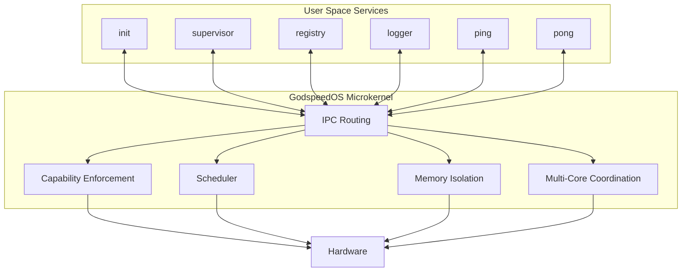

# GodspeedOS

> *Small enough to understand. Rigorous enough to trust.*

A deliberately small, capability-based microkernel operating system built around explicit authority, bounded behavior, visible failure, and disciplined systems design.

---

# Why GodspeedOS Exists

Modern software systems are incredibly powerful — but also increasingly opaque.

Layers upon layers of abstractions, hidden retries, implicit permissions, silent fallbacks, background daemons, and sprawling dependencies have made many systems difficult to fully understand, reason about, or trust.

GodspeedOS exists as a response to that complexity.

Not to compete with existing operating systems.

But to explore a different question:

> What would an operating system look like if every major design decision prioritized clarity, explicitness, isolation, and coherence first?

The result is a small capability-based microkernel written in Rust where:

- authority is explicit
- failures are visible
- behavior is bounded
- services are isolated
- recovery is intentional
- and every subsystem is designed to be explainable end-to-end

The goal is not maximal features.

The goal is a system small enough to fully reason about and rigorous enough to trust.

---

# Design Principles

GodspeedOS is built around six core principles:

- Identity over location
- Explicit authority
- Bounded behavior
- Typed capabilities
- Failure visibility
- No silent fallback

These principles influence every subsystem in the kernel and every service running on top of it.

---

# Core Philosophy

## Identity over location

A service’s identity remains stable even if its execution location changes.

Clients communicate with a named service, not “whatever happens to be on core 1.”

If a service crashes and restarts on another CPU core:

- old capabilities become stale
- clients receive `EndpointDead`
- the registry provides a fresh capability
- communication resumes

The name remains stable.

The location does not.

This separation between identity and placement is one of the foundational ideas in GodspeedOS.

---

## Explicit authority

GodspeedOS rejects ambient authority.

There is no:
- global root context
- invisible privilege inheritance
- “because the process is trusted”
- hidden access path

Every privileged action requires an explicit capability.

If a service does not hold the capability:
- it cannot perform the operation
- it cannot forge the operation
- it cannot escalate into the operation

Authority is visible in:
- contracts
- code review
- capability tables
- and runtime behavior

The system is designed so that permissions remain understandable.

---

## Bounded behavior

Every critical subsystem in GodspeedOS has explicit limits.

Examples:
- queues are bounded
- capability tables are bounded
- task slots are bounded
- message sizes are bounded
- memory budgets are bounded

Unbounded behavior eventually becomes undefined behavior.

GodspeedOS prefers:
- predictable limits
- explicit rejection
- visible backpressure

over silent degradation.

The system should fail honestly instead of degrading invisibly.

---

## Typed capabilities

Not all authority is equal.

A capability carries:
- a resource identity
- a generation
- a rights set

Rights are explicit:
- SEND
- RECV
- GRANT
- READ
- WRITE
- REVOKE

Capabilities cannot silently widen during transfer.

A transferred capability can only preserve or reduce authority — never increase it.

This makes authority composable, inspectable, and testable.

---

## Failure visibility

Distributed and concurrent systems cannot eliminate failure.

But they can decide whether failure becomes:
- visible
- bounded
- recoverable
- coherent

or:
- hidden
- ambiguous
- silently corrupting

GodspeedOS chooses visibility.

Examples:
- stale capabilities return `EndpointDead`
- queues return `QueueFull`
- over-budget allocation returns `AllocDenied`
- invalid authority returns `CapNotHeld`
- malformed ELF binaries panic loudly during bootstrap

Failure is treated as part of the architecture — not an edge case.

---

## No silent fallback

One of the strongest design rules in GodspeedOS:

> The system must never silently become a different system.

Examples:
- local IPC does not silently become remote IPC
- capability failure does not silently retry
- memory exhaustion does not silently overcommit
- invalid authority does not silently downgrade security
- unavailable services do not silently redirect elsewhere

A caller should always know:
- what happened
- what guarantees exist
- and what guarantees no longer exist

---

# FRILS Thinking

GodspeedOS is heavily influenced by a systems-thinking model called **FRILS** — a framework created during the design of the project itself.

| Principle | Meaning |
|---|---|
| **Failure** | Assume components fail |
| **Recovery** | Define recovery behavior explicitly |
| **Isolation** | Prevent failures from spreading |
| **Load** | Design for saturation and pressure |
| **State** | Make ownership and transitions explicit |

FRILS became one of the architectural lenses through which the kernel, services, scheduler, capability model, and testing philosophy were designed.

The operating system assumes:
- failures are inevitable
- recovery must be coherent
- load must be bounded
- and state must never become ambiguous

Reliability emerges from:
- explicit constraints
- visible failure
- coherent recovery semantics
- and disciplined state management

—not from hiding complexity.

---

# Constraint-Driven Design

GodspeedOS is designed through constraints first, implementation second.

Examples:
- bounded queues
- bounded memory
- explicit authority
- isolated failure domains
- visible state transitions
- deterministic recovery paths

The project assumes that good systems emerge from clear constraints — not from unlimited flexibility.

> Constraints create coherence.

---

# Truthfulness in Software

GodspeedOS prefers honest behavior over comforting behavior.

The system does not silently:
- retry
- reroute
- overcommit
- escalate privileges
- downgrade guarantees
- or mask failures

If a guarantee no longer holds, the caller is told explicitly.

The philosophy is simple:

> A system that lies about failure eventually lies about correctness.

---

# Why Small Matters

Complexity is not free.

Every hidden subsystem, implicit behavior, fallback path, global mutable state,
or unbounded abstraction increases the gap between:
- what developers think the system does
- and what the system actually does

GodspeedOS intentionally keeps the trusted core small so that:
- behavior remains explainable
- invariants remain testable
- failures remain visible
- and the system can still be reasoned about end-to-end

Small is not a limitation.

Small is a design constraint.

---

# High-Level Architecture



---

# Architecture Overview

GodspeedOS is a capability-based microkernel.

The kernel itself is intentionally small.

Its responsibilities are limited to:

- memory isolation
- scheduling
- IPC routing
- capability enforcement
- interrupt routing
- multi-core coordination

Everything else lives in isolated user-space services.

Examples:
- init
- supervisor
- registry
- logger
- future filesystem
- future networking stack
- future graphics stack

Policy belongs to services.

Mechanism belongs to the kernel.

---

# Testing Philosophy

GodspeedOS treats testing as architecture — not QA.

The system currently includes:

| Category | Purpose |
|---|---|
| Identity tests | Verify constitutional invariants |
| Property tests | Verify universal correctness |
| Fuzz tests | Verify panic resistance |
| Stress tests | Verify long-term stability |
| Performance tests | Detect regressions |
| Adversarial tests | Verify security boundaries |
| Chaos tests | Verify graceful degradation |

The philosophy is simple:

> A bug fixed without a regression test is not actually fixed.

Several real kernel bugs were discovered through these suites:
- stale-cap races
- allocator corruption
- task re-animation
- phantom frame reuse
- overflow edge cases
- TLB invalidation races

Each fix became a permanent invariant test.

---

# Why So Much Testing?

GodspeedOS treats testing as part of the architecture itself.

Identity tests verify constitutional invariants.

Property tests verify universal correctness across randomized inputs.

Fuzz tests verify that hostile input cannot panic the kernel.

Chaos tests verify that failure remains bounded and coherent under stress.

The goal is not “high coverage.”

The goal is confidence that the system remains the system it claims to be.

---

# Current Status

Current achievements include:
- SMP scheduling
- ring-3 user services
- capability-based IPC
- supervisor-driven restart flow
- cross-core service recovery
- identity/property/fuzz/chaos testing
- bounded memory enforcement
- capability transfer semantics
- TLB shootdown validation
- restart-safe endpoint generation
- constrained authority enforcement

Current focus:
- deeper hardening
- more brutal testing
- long-duration stability
- constrained-hardware validation
- future graphics experimentation
- future networking exploration

---

# Repository Layout

```text
kernel/        bare-metal microkernel
services/      user-space system services
sdk/rust/      Rust SDK for service development
osdev/         build/test/run tooling
contracts/     service contracts and schemas
docs/          architecture notes and design docs
tests/         identity, property, fuzz, stress, chaos suites
```

---

# Getting Started

## Requirements

- Rust nightly
- QEMU
- x86_64 host machine

The exact toolchain version is pinned in `rust-toolchain.toml`.

---

## Build

```bash
cargo build --target x86_64-unknown-none -p kernel
```

---

## Run

```bash
cargo run -p osdev -- run --smp 4
```

---

## Run Identity Tests

```bash
cargo run -p osdev -- test identity
```

---

## Run Property Tests

```bash
cargo run -p osdev -- test property
```

---

## Run Chaos Tests

```bash
cargo run -p osdev -- test chaos
```

---

# Future Direction

Future exploration may include:
- graphics stack
- networking
- cluster-aware services
- remote IPC
- storage drivers
- constrained-hardware targets
- explicit GPU APIs
- distributed capability routing

These will only be added if they preserve the architectural principles of the system.

---

# Design Reference

The complete architecture, capability model, scheduler semantics, IPC guarantees, testing philosophy, and constitutional invariants are documented in:

```text
CLAUDE.md
```

The system is defined there first.

The implementation exists to satisfy it.