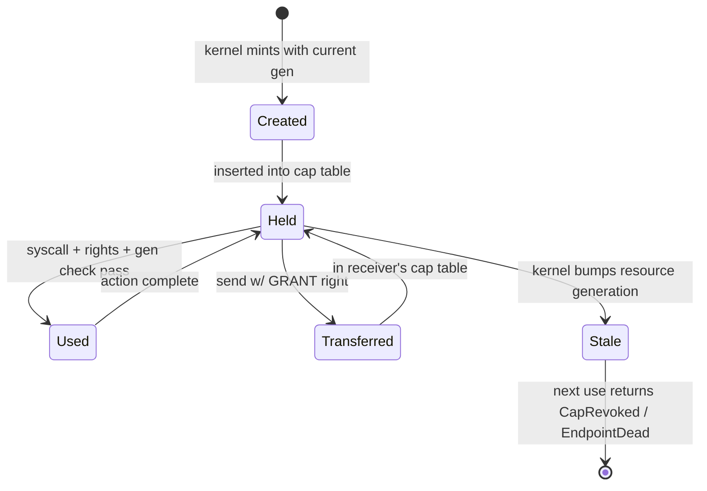

# kernel/src/capability/

The capability system (§7). Unsafe boundary: the global resource table uses a raw static; access is serialised by a single global `SpinLock` (§7.8).

## Files

| File             | Responsibility |
|------------------|---------------|
| `mod.rs`         | Public API: re-exports, `init()` |
| `cap.rs`         | `Capability` struct (ResourceId + Rights + Generation), `validate()`, `narrow_for_grant()`, `CapError` enum |
| `rights.rs`      | `Rights` bitfield: READ, WRITE, SEND, RECV, GRANT, REVOKE |
| `generation.rs`  | `Generation` monotonic counter; `bump()` |
| `table.rs`       | `CapTable` (per-task, 64 slots), `GlobalResourceTable` (kernel-wide) |
| `revoke.rs`      | `revoke(resource_id)`: bumps generation, lazily invalidates all outstanding caps |
| `delegated.rs`   | The delegated-resource band (§7.10, file-as-capability): allocate, owner lookup, revoke, release on owner death |
| `mod.rs`         | Also the well-known kernel resource ids (`LOG_WRITE_RESOURCE` 1 ... `CPU_CLOCK_RESOURCE` 18) |

## The generation contract (§7.5)

- **Every syscall that touches a resource validates the cap before acting.** No exceptions. The live check is `CapTable::get(slot, right)` (held, generation current, right present); `Capability::validate` states the same rule and is exercised by the unit tests.
- On a stale cap `CapTable::get` returns `EndpointDead` or `CapRevoked` itself, chosen by the resource's recorded liveness (Dead or Revoked). `validate` returns `GenerationMismatch`, which the dispatcher would map to `CapRevoked` (-6).
- The by-holdings gate (`holds_resource`) skips the generation check, so it is sound only for the stable gate resources (ids below 100), which are never revoked - `bump_generation` debug-asserts it (SEC-11).
- Generation bump is **lazy invalidation**: outstanding caps in remote tasks' tables are NOT deleted. They become stale and fail on next use. This is safe because the generation check is atomic and the bump is visible to all cores after a memory barrier.

## Rights non-escalation (§7.3)

`narrow_for_grant` asserts in debug builds that it does not widen rights. If you are calling `narrow_for_grant` and the assert fires, the caller is violating the cap model. Note that nothing outside the unit tests calls it today: the live paths keep non-escalation by never constructing wider rights - a transfer or `DeriveCap` copies the held cap whole (GRANT-gated), `SpawnWithCaps`/`SpawnImage` installs copy a cap the caller holds with GRANT, and an embedded delegated cap is narrowed with `without_grant` (SEC-7).

## Concurrency (§7.8)

v1: a single global `SpinLock` around `GlobalResourceTable` - the single global lock §7.8 approves (amended 2026-09-12), plain mutual exclusion. There is no `RwLock` type in the kernel, so READS SERIALISE TOO: a cap lookup + generation check takes the same exclusive lock a spawn does, and can spin behind it. (This said "reads take a read lock" and "reads are concurrent", which was a performance claim the code never made.) A known bottleneck; sharding is v2 work requiring benchmarks (see B7 in `tests/qemu/perf/CLAUDE.md`).

Per-task `CapTable` takes no lock: a task's own syscalls run only on its pinned core. Other cores do READ it - `TaskCaps` and `assert_cap_table_consistent` walk any task's table - as a best-effort snapshot (`scheduler::for_each_cap_of`).

## Capability lifecycle diagram (§7.6)

