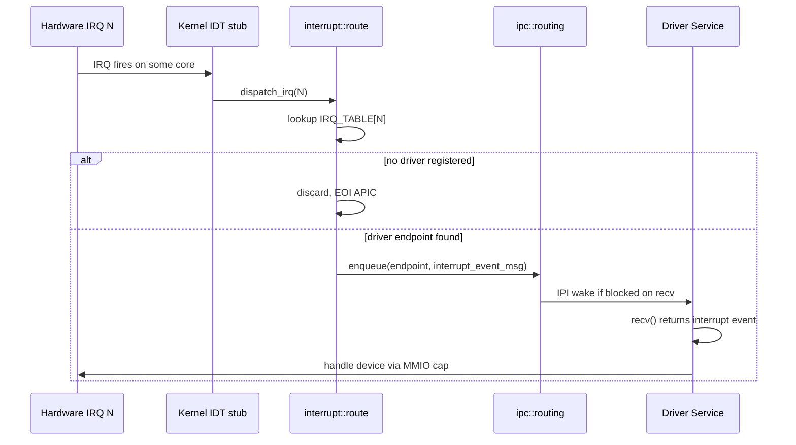

# kernel/src/interrupt/

Hardware interrupt routing to userspace driver services (§12).

## Files

| File        | Responsibility |
|-------------|---------------|
| `mod.rs`    | Module declaration |
| `route.rs`  | `IRQ_TABLE[256]`, `register(irq, endpoint)`, `deliver(irq)` |

## How it works (§12.2)

## Registration

`register(irq, endpoint)` is called from the spawn path when the kernel processes a `hw_interrupt` capability (§12.3). It is called exactly once per IRQ line per system lifetime (drivers are non-restartable only if they are in the TCB; otherwise restart re-registers).

`IRQ_TABLE` is a `SpinLock<[Option<EndpointId>; 256]>`. `register()` is a safe function. `deliver()` is `pub unsafe fn` because it is called from the IDT with IF=0 — the `unsafe` communicates the interrupt-context calling convention, not a memory-safety obligation.

## If no driver is registered

`deliver` discards the IRQ with no log message and no panic. The kernel cannot know whether a driver will register later (AP timing during boot). The driver will start receiving queued interrupts once it registers.

## Kernel does not handle device logic

The kernel IDT routes IRQs to userspace and EOIs the APIC. Everything after that — MMIO reads, DMA, protocol state machines — lives in the driver service. The `hw_mmio` capability grants the driver direct access to its device's MMIO region; no kernel mediation at runtime.
