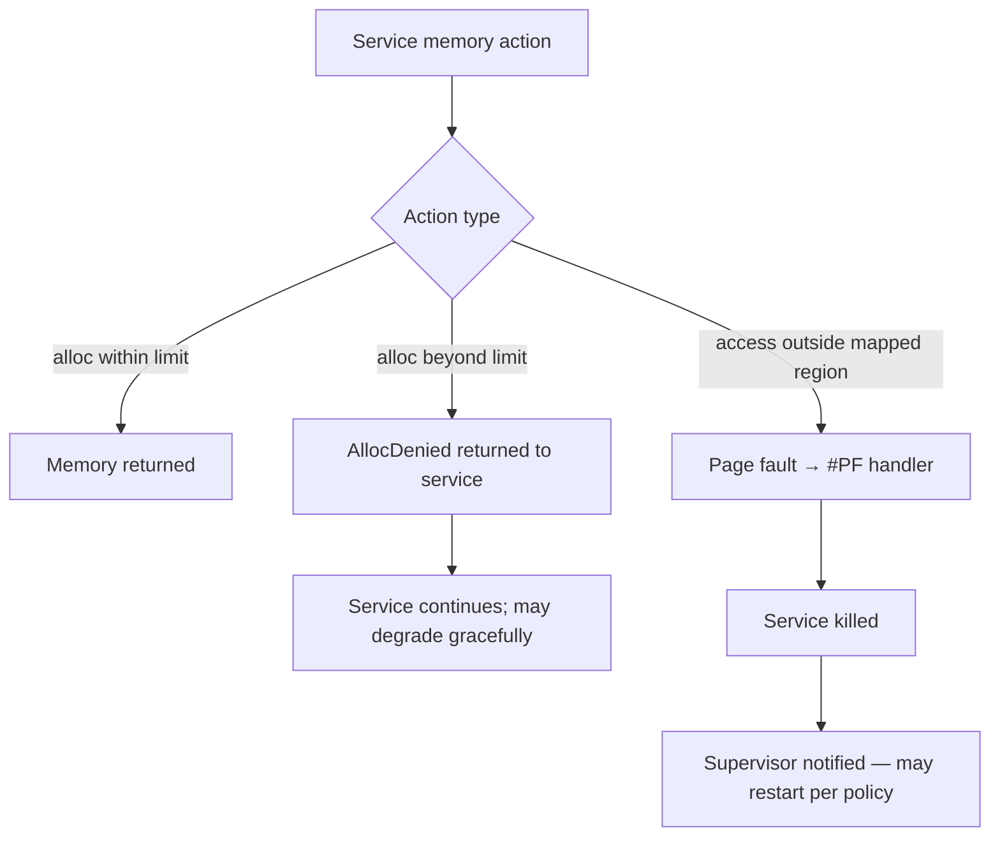

# kernel/src/memory/

Physical memory management (§10). Unsafe boundary: raw physical addresses appear only in `frame.rs` and `allocator.rs`.

## Files

| File            | Responsibility |
|-----------------|---------------|
| `mod.rs`        | Public entry point: `init(boot_info)` |
| `frame.rs`      | `Frame` (owned 4 KiB page) and `PhysAddr` types |
| `page.rs`       | `Page` (virtual page address) — typed index into page tables |
| `allocator.rs`  | Frame allocator: `alloc_frame()` / `free_frame(frame)` |
| `ownership.rs`  | `TaskMemoryOwner`: per-task frame set + limit enforcement |

## Design rules

- **`Frame` is an owned type.** Dropping a `Frame` without calling `free_frame` leaks memory. There is no `Drop` impl that auto-frees because auto-free would require a global lock inside `Drop`, which is unsound in interrupt context.
- **`AllocDenied` is recoverable; page fault is not (§10.4).** `TaskMemoryOwner::track_alloc` returns `Err(AllocDenied)` when a task's limit would be exceeded. The task can handle this gracefully. A protection violation kills the task (handled in `arch/x86_64/interrupts.rs`).
- **TLB shootdown before frame free.** `ownership.rs`'s `reclaim_all` does NOT issue the shootdown — its caller (the task death path in `task/mod.rs`) calls `smp::ipi::broadcast_tlb_shootdown` first, then `reclaim_all`, then `allocator::free_frame` for each returned frame.
- **PML4 frame deferred in self-kill.** The PML4 frame is skipped during `reclaim_all` in the self-kill path (dying task's CR3 still active) and stored in `CORE_PENDING_PML4[core]`. It is freed at the next `drain_pending_kstack` call when a different CR3 is loaded. This prevents a CR3 use-after-free kernel page fault.

## Limit enforcement flow

1. Supervisor sets `limit_bytes` from the contract at spawn time.
2. Every `alloc` syscall calls `TaskMemoryOwner::track_alloc` first.
3. If `track_alloc` returns `Err(AllocDenied)`, the syscall returns the error to the service — kernel does not kill the task.
4. A service that ignores `AllocDenied` and touches unmapped memory triggers a page fault → task killed.

## Memory enforcement flowchart (§10.3)

