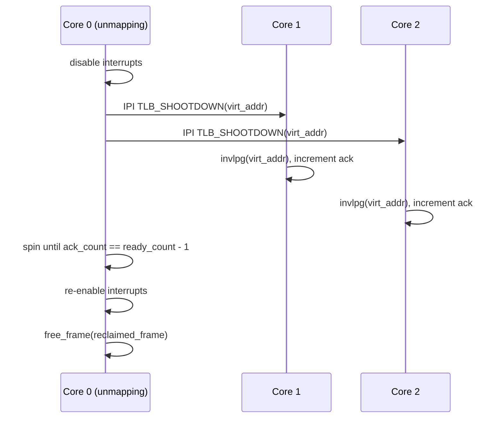

# kernel/src/smp/

Multi-core coordination (§9, §11). Unsafe boundary: APIC MMIO writes in `ipi.rs`.

## Files

| File            | Responsibility |
|-----------------|---------------|
| `mod.rs`        | `init(boot_info)`: init per-core state, start APs |
| `core.rs`       | `CoreState` per core; `mark_ready(core_id)`, `ready_count()`, `is_ready(core_id)` |
| `ipi.rs`        | `send_ipi(core_id, vector)`, `broadcast_tlb_shootdown(virt)`, `ipi_handler(vector)` |
| `placement.rs`  | `resolve(contract_core)` → `Ok(core_id)` or `Err(PlacementInvalid)` |
| `spinlock.rs`   | `SpinLock<T>` / `SpinLockGuard<T>` — RAII spinlock for safe mutable statics throughout the kernel |

## SpinLock usage

`SpinLock<T>` is the standard way to protect mutable kernel globals outside the permitted unsafe layers. All unsafe code lives in `spinlock.rs` itself (4 lines: `unsafe impl Send`, `unsafe impl Sync`, two `UnsafeCell::get()` deref calls in `Deref`/`DerefMut`). Call sites are entirely unsafe-free:

```rust
static FOO: SpinLock<[T; N]> = SpinLock::new([...]);
let mut guard = FOO.lock();   // RAII; releases on drop
guard[i] = value;
```

`try_lock()` is available for non-blocking acquisition (returns `Option<SpinLockGuard>`).

## Core lifecycle (§9.5)

Cores discovered at boot are fixed for the system lifetime. No hotplug. The core count is `BootInfo.ap_ids.len() + 1` (the +1 is the BSP). Any core that fails to call `mark_ready` within the timeout is logged as a warning and excluded from placement (§11.3).

## IPI vectors

Three distinct vectors, defined in `ipi::vectors`:

| Vector              | Value | Purpose |
|---------------------|-------|---------|
| `WAKE_RECEIVER`     | 0xF0  | Wake a task blocked on `recv` (cross-core send) |
| `TLB_SHOOTDOWN`     | 0xF1  | Invalidate a page on remote TLBs (unmap) |
| `SCHEDULER_TICK`    | 0xF2  | Force a scheduling point (timer overflow broadcast) |

## TLB shootdown protocol (§10.5)



This is a synchronous barrier. It is a real cost on every unmap. v1 minimises unmap frequency by reclaiming memory only at service death.

**Concurrent shootdowns are safe (per-core requests).** Each *initiating* core has its own request slot — `SHOOTDOWN_ADDR/GEN/ACK[core]` in `ipi.rs` — and a core waiting for its own acks also services every other core's pending request (`service_pending`, called from both the IPI handler and the ack-wait spin). So two cores unmapping at the same time ack each other instead of deadlocking. The single-global `TLB_ACK`/`TLB_SHOOTDOWN_ADDR` counter this replaced **deadlocked** under concurrent reclaims: each initiator spun IF=0 waiting for the other's ack while being a target of the other's all-excluding-self broadcast, so neither could ack — the `chaos max-carnage` 71K-round wedge on the T630. The diagram above is still the single-unmapper common case; the per-core slots generalise it to N simultaneous unmappers.

## Placement (§9.2)

`resolve(contract_core)` returns the core a new service instance should run on:
- `Some(n)` → requires core `n`; returns `PlacementInvalid` if `!is_ready(n)`.
- `None` → round-robin via `RR_COUNTER % ready_count`.

On restart, `resolve` is called again with the same contract. The previous core is not remembered (§9.2 "on restart" clause).
