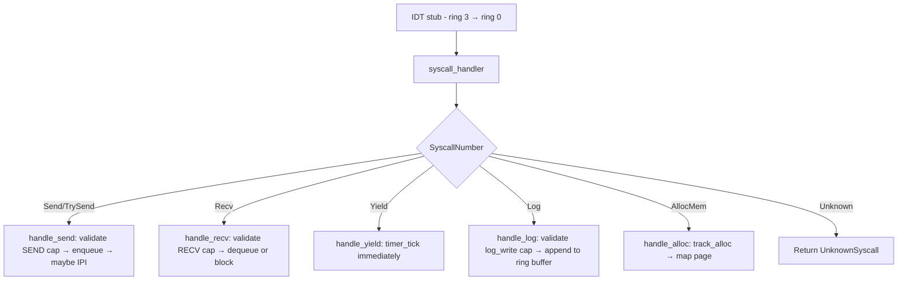

# kernel/src/syscall/

Syscall entry point and dispatch (§8.2, §7.5).

## Files

| File           | Responsibility |
|----------------|---------------|
| `mod.rs`       | Module declaration |
| `dispatch.rs`  | `syscall_handler(number, arg0, arg1, arg2)` - raw entry from IDT stub; dispatch table |

## Invariant: cap before action

Every syscall that performs a privileged action must call `CapTable::get(slot, required_right)` before doing anything with the resource. This is invariant §3.1. `invariants::assertions::assert_cap_validated` is called on the result.

If you are adding a syscall:
1. Assign it a number in `SyscallNumber`.
2. Add a handler `handle_<name>` in `dispatch.rs`.
3. The first thing `handle_<name>` does is validate the capability.
4. There are no exceptions to this rule.

**Two validation forms.** Most syscalls take a `cap_slot` argument and validate
with `CapTable::get(slot, right)`. A handful of syscalls whose arguments fill all
the ABI registers and leave no slot to pass - the introspection reads
(`InspectKernel` 13 system queries, `TaskStat` 16) and `Kill` (8, both args carry
the name) - instead validate by **holdings**:
`scheduler::current_task_holds_resource(rid, right)` confirms the calling task
holds the gating resource (INTROSPECT for the reads, SERVICE_CONTROL for kill).
This still satisfies §3.1 (a capability is validated before the privileged
action); only the calling convention differs. `holds_resource` is for **stable**
resources only (gen 0 forever) - see `docs/introspection-capability.md`,
`docs/service-control-cap.md`, and the note on its definition in
`capability/table.rs`.

## Syscall table (v1)

| Number | Name        | Required cap right             |
|--------|-------------|--------------------------------|
| 1      | `send`      | SEND                           |
| 2      | `recv`      | RECV                           |
| 3      | `try_send`  | SEND                           |
| 4      | `yield`     | none                           |
| 5      | `log`       | log_write cap                  |
| 6      | `alloc_mem` | implicit (own task memory)     |
| 7      | `spawn`     | SPAWN (WRITE)                  |
| 8      | `kill`      | SERVICE_CONTROL (WRITE) - held by shell/supervisor/probes; validated by holdings (no slot - both args carry the name). See `docs/service-control-cap.md` |
| 13     | `inspect_kernel` | INTROSPECT (READ) for system queries 1,2,4,5,6,7,8; **none** for the ungated task-neutral reads: 0 (own alloc), 3 (TSC), 9 (fbcon geometry), 10 (input-ready), 11 (RTC), 12 (boot datetime), 13 (console-foreground-allows for the calling task) |
| 16     | `task_stat` | INTROSPECT (READ) - discloses any task's state |
| 18     | `reboot`    | REBOOT (WRITE) - held by `shell` (its `reboot` cmd) + `xhci`/`ehci` (Ctrl+Alt+Del); validated by holdings (no args). Closes the ambient-reboot gap |

## Safety

`syscall_handler` is `unsafe extern "C"` because it is called from a raw IDT stub at the ring 3 → ring 0 boundary. Arguments are raw register values from untrusted user code:
- Never dereference `arg*` as a kernel pointer.
- Always validate length fields before copying user memory.
- Always validate cap slots are within `0..MAX_CAPS_PER_TASK`.

User-pointer operations go through `arch::x86_64::read_user_bytes(ptr, len)` and `write_user_bytes(dst, src)`, which validate the pointer range before touching memory. Do not use `from_raw_parts` or `copy_nonoverlapping` directly in handler functions - use those wrappers instead.

## Dispatch flow

