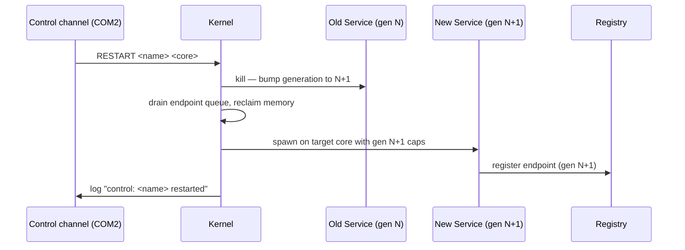

# services/supervisor/

Restart + name authority. TCB member (§6.1, trusted) — but **restartable** (Path C / Phase 6): the
kernel respawns it on death, so its failure is recovered, not a reboot. The kernel is the only
unkillable thing. Spawned directly by the kernel (init removed, Phase 5).

## Responsibilities

- Read the boot manifest and spawn all non-TCB services per placement rules (§9.2).
- Monitor services for death (via kernel death-notification endpoint).
- Kill and restart failed services.
- Expose `kill` and `restart` API (§14.4).
- Log all lifecycle events.

## Build features

The supervisor has mutually exclusive spawn-set features:

| Feature            | Spawns                                  | Used by                          |
|--------------------|-----------------------------------------|----------------------------------|
| *(none)*           | pong + ping + all 178 probe services    | `osdev run` (full QEMU build)    |
| `identity-only`    | pong + ping + 15 identity probe services | `osdev test identity`            |
| `perf-only`        | pong + ping + B1–B10 perf probes        | `osdev test perf`                |
| `perf-brutal-only` | pong + ping + BP1–BP10 brutal probes    | `osdev test perf-brutal`         |
| `stress-only`      | pong + ping + S1–S10 stress probes      | `osdev image --mode stress`      |
| `adv-only`         | pong + ping + A1–A10 adversarial probes | `osdev image --mode adv`         |
| `chaos-only`       | pong + ping + C2–C7 chaos probes        | `osdev image --mode chaos`       |
| `fuzz-only`        | pong + ping + F1/F2/F5/F6/F7/F8 + BF1/BF2/BF5/BF6/BF7/BF8 fuzz probes | `osdev image --mode fuzz` |
| `bare-metal`       | shell only — rests at a quiet `gsh>`     | `osdev image` (USB boot)         |

The `bare-metal` feature exists because probe services require the QEMU control port (COM2/TCP:5555) to complete. Without it, probe-4b-send blocks permanently, and probe-hog runs `loop {}` starving core 0. On real hardware these probes would stall the system indefinitely.

**Bare-metal also skips ping/pong/observe** so the USB image boots to a calm, static `gsh>` prompt instead of an endless `pong: received`/`observe:` scroll — the right resting state for a usable OS with a display. ping and pong are demo services spawnable on demand from the shell (`spawn pong` then `spawn ping`). The §23 cross-core demo still runs under `osdev run`/QEMU.

Introspection is reached through shell **commands**, not raw spawn: `observe` (live full-screen view, `q` to quit) and `observe now` (one-shot frame). The bare `observe` *service* (probe_mode 0) is the `osdev run` serial-streaming build — it scrolls forever and ignores `q`, so the shell refuses `spawn observe`/`observe-now`/`observe-live` and points the user at the commands instead.

## Spawn order in `service_main`

The kernel spawns the supervisor **directly** (Path C / Phase 5 — init is removed). The supervisor
spawns the **logger first** (moved from init), then pong/ping, then services it wires from its
`name → cap` map. The registry *service* is retired (Phase 4); names resolve via the kernel's
directory (`ipc::names` + `AcquireSendCap`), not a registry service. The probe spawn loop takes
18–120 s on Windows TCG; spawning pong/ping early ensures cross-core IPC between them is established
within ~10 s of boot.

```
service_main():
  1. spawn("logger")              ← moved here from init (Phase 5); not TCB, retry once
  2. spawn("pong") on core 1      ← pong must precede ping (SEND cap wired at spawn)
  3. spawn("ping") on core 0
  4. spawn probe / bare-metal services from the name→cap map (no kernel name resolution)
  5. log("supervisor: ready")
  6. loop { recv() }  ← death-notification restart loop
```

`"supervisor: ready"` appears after **all** spawns complete. Identity tests that trigger a service restart use this string as the `wait_for` gate to ensure the restart fires only when supervisor is safely in its yield loop — no restart-mid-spawn conflict.

## Sole holder of `service_control`

The `service_control` capability is held **only** by supervisor. No other service can kill or restart another service. This is the enforcement mechanism for §3.1 (no ambient authority) at the service lifecycle level.

## Placement on restart (§9.2, §14.4)

When supervisor calls `restart(name, placement_override)`:
- If `placement_override` is `Some(n)`: requires core `n`; fails with `PlacementInvalid` if that core is unavailable.
- If `placement_override` is `None`: re-evaluates from the service contract — same rules as initial spawn.
- **The previous core is NOT remembered.** A service on core 1 that is restarted without an override may land on core 2.

## Restart flow



## Failure semantics (§6.2)

Supervisor death = **kernel respawn** (Path C / Phase 6), not a reboot. The kernel is the supervisor's
recovery anchor — when it dies (a fault, or `chaos kill-storm supervisor`), the kernel respawns it
unconditionally and forever (no bound — a bound would re-introduce the reboot and be a DoS). The
respawned supervisor reconciles: it adopts the still-running services (reacquiring each by name from
the kernel directory) instead of duplicating them, and respawns any that died. The only unkillable
component is the kernel itself (`{kernel}`). Pinned by §22 Test 15.

## API (§14.4)

```rust
supervisor.kill(service_name)                              -> Result<()>
supervisor.restart(service_name, placement_override?)      -> Result<()>
```

Both require the `service_control` capability which only supervisor holds.
