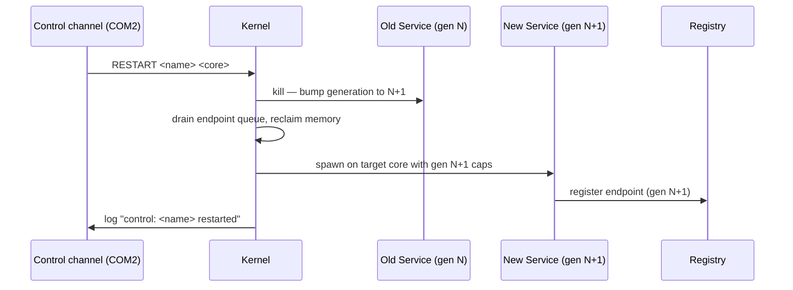

# services/supervisor/

Restart authority. TCB member (§6.1). **Non-restartable.**

## Responsibilities

- Read the boot manifest and spawn all non-TCB services per placement rules (§9.2).
- Monitor services for death (via kernel death-notification endpoint).
- Kill and restart failed services.
- Expose `kill` and `restart` API (§14.4).
- Log all lifecycle events.

## Build features

The supervisor has mutually exclusive spawn-set features:

| Feature            | Spawns                                  | Used by                          |
|--------------------|-----------------------------------------|----------------------------------|
| *(none)*           | pong + ping + all 178 probe services    | `osdev run` (full QEMU build)    |
| `identity-only`    | pong + ping + 15 identity probe services | `osdev test identity`            |
| `perf-only`        | pong + ping + B1–B10 perf probes        | `osdev test perf`                |
| `perf-brutal-only` | pong + ping + BP1–BP10 brutal probes    | `osdev test perf-brutal`         |
| `stress-only`      | pong + ping + S1–S10 stress probes      | `osdev image --mode stress`      |
| `adv-only`         | pong + ping + A1–A10 adversarial probes | `osdev image --mode adv`         |
| `chaos-only`       | pong + ping + C2–C7 chaos probes        | `osdev image --mode chaos`       |
| `bare-metal`       | pong + ping only (no probes)            | `osdev image` (USB boot)         |

The `bare-metal` feature exists because probe services require the QEMU control port (COM2/TCP:5555) to complete. Without it, probe-4b-send blocks permanently, and probe-hog runs `loop {}` starving core 0. On real hardware these probes would stall the system indefinitely.

## Spawn order in `service_main`

Pong and ping are spawned **first**, before all probe services. The probe spawn loop takes 18–120 s on Windows TCG; spawning pong/ping first ensures cross-core IPC between them is established within ~10 s of boot.

```
service_main():
  1. spawn("pong") on core 1  ← pong must precede ping (SEND cap wired at spawn)
  2. spawn("ping") on core 0
  3. spawn probe services (§22 test infrastructure) — skipped in bare-metal mode
  4. log("supervisor: ready")
  5. loop { yield_cpu() }
```

`"supervisor: ready"` appears after **all** spawns complete. Identity tests that trigger a service restart use this string as the `wait_for` gate to ensure the restart fires only when supervisor is safely in its yield loop — no restart-mid-spawn conflict.

## Sole holder of `service_control`

The `service_control` capability is held **only** by supervisor. No other service can kill or restart another service. This is the enforcement mechanism for §3.1 (no ambient authority) at the service lifecycle level.

## Placement on restart (§9.2, §14.4)

When supervisor calls `restart(name, placement_override)`:
- If `placement_override` is `Some(n)`: requires core `n`; fails with `PlacementInvalid` if that core is unavailable.
- If `placement_override` is `None`: re-evaluates from the service contract — same rules as initial spawn.
- **The previous core is NOT remembered.** A service on core 1 that is restarted without an override may land on core 2.

## Restart flow



## Failure semantics (§6.2)

Supervisor death = kernel panic = system reboot. No silent recovery. This is intentional: the supervisor is the system's recovery authority; without it there is no meaningful recovery possible.

## API (§14.4)

```rust
supervisor.kill(service_name)                              -> Result<()>
supervisor.restart(service_name, placement_override?)      -> Result<()>
```

Both require the `service_control` capability which only supervisor holds.
