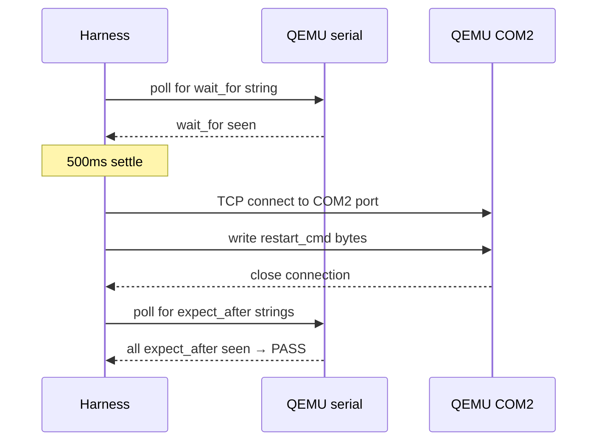

# tests/qemu/harness/

Shared test infrastructure (§22.3). Used by all test suites under `tests/qemu/`.

## Responsibilities

| Component           | What it does |
|---------------------|--------------|
| QEMU launcher       | Spawns `qemu-system-x86_64` with configurable `-smp N`; enables `-enable-kvm -cpu host` when `/dev/kvm` exists |
| Serial reader       | Reads from a temp file QEMU writes to; polls every 200 ms; accumulates lines for assertion |
| Test runner         | Drives `TestKind` variants; manages deadline; reports PASS/FAIL |
| COM2 control channel| Opens a TCP socket to QEMU's COM2 to inject `RESTART`/`KILL` commands for `WithRestart` tests |
| Artifact upload     | On failure, preserves the serial log for post-mortem inspection |

## TestKind variants

The harness supports three test kinds, each with its own drive loop:

```
WatchSerial { expect, fail_on, timeout_secs }
  - polls serial until all expect strings appear (in any order within the line stream)
  - fails immediately if any fail_on string appears

WithRestart { wait_for, restart_cmd, expect_after, fail_on, timeout_secs }
  - Phase 1: poll_serial until wait_for string appears
  - 500 ms settle pause
  - Send restart_cmd to QEMU COM2 control port
  - Phase 2: poll_serial until all expect_after strings appear
  - Same deadline covers both phases

WithBadTcb { expect, fail_on, timeout_secs }
  - Boots a kernel image with a deliberately corrupted TCB binary
  - Expects KERNEL PANIC + reason string
```

## `WithRestart` flow



## Per-test timeouts

Timeouts are per-test, not a global 30 s. On Linux KVM (CI), all tests complete in <30 s. On Windows TCG (no hardware virtualisation), the supervisor spawns 178+ probe services before logging "supervisor: ready", taking 18-120 s. Timeouts are sized to cover the TCG worst case:

| Category            | Typical timeout |
|---------------------|-----------------|
| Simple WatchSerial  | 30s             |
| Probe-dependent     | 60-120s         |
| WithRestart (pong)  | 180s            |

## KVM detection

`QemuTestInstance::new` checks for `/dev/kvm` at construction time:

```rust
fn kvm_available() -> bool {
    std::fs::metadata("/dev/kvm").is_ok()
}
```

If KVM is present, `-enable-kvm -cpu host` is appended to the QEMU args. Falls back silently to TCG on Windows and on Linux hosts without KVM (e.g., nested VMs).

## QEMU binary path

The harness looks for `qemu-system-x86_64` on PATH.
- Linux: typically `/usr/bin/qemu-system-x86_64`
- Windows: typically `C:\Program Files\qemu\qemu-system-x86_64.exe` - ensure this is on PATH.

## Failure modes

A test FAILS if:
- Any `fail_on` string appears on serial.
- `KERNEL PANIC` appears when not expected.
- The per-test timeout fires without all `expect` strings seen.
- QEMU exits with a non-zero code before the timeout.
- The COM2 TCP connection fails for a `WithRestart` test.
