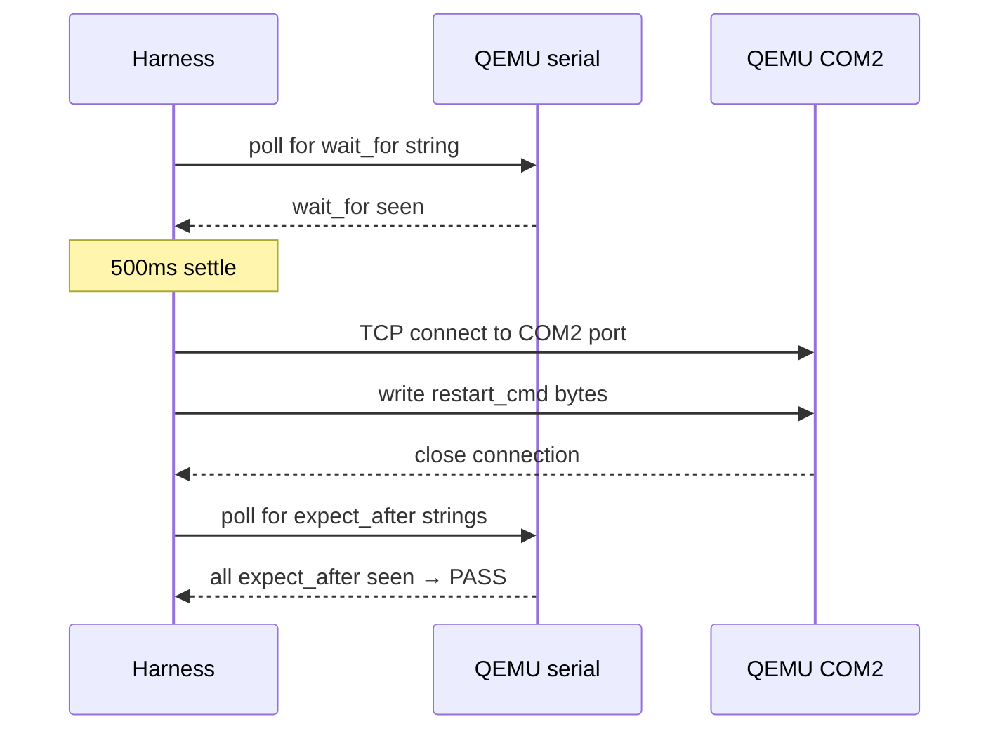

# tests/qemu/harness/

Shared test infrastructure (§22.3). There is no code in this directory: the harness is `osdev/src/qemu.rs` (launch) and `osdev/src/validator.rs` (`run_one`, `poll_serial`).

## Responsibilities

| Component           | What it does |
|---------------------|--------------|
| QEMU launcher       | Spawns `qemu-system-x86_64` with configurable `-smp N`; adds `-enable-kvm` when `/dev/kvm` exists |
| Serial reader       | Re-reads the serial file QEMU writes (`build/tests/<suite>/<id>-<name>.log`) every 200 ms and searches the whole content |
| Test runner         | Drives `TestKind` variants; manages deadline; reports PASS/FAIL |
| COM2 control channel| Opens a TCP socket to QEMU's COM2 to inject `RESTART`/`KILL` commands for `WithRestart` tests |
| Serial logs         | Every run's serial log is left under `build/tests/`, pass or fail |

## TestKind variants

The identity suite uses three of the `TestKind` variants (the enum also has `WithBadElf`, `WithBadElfBrutal`, `ContractFuzz`, `DegradedSmp`, `DegradedEnv` and `Blocked`, used by the other suites):

```
WatchSerial { expect, fail_on, timeout_secs }
  - polls serial until all expect strings appear (in any order within the line stream)
  - fails immediately if any fail_on string appears

WithRestart { wait_for, restart_cmd, expect_after, fail_on, timeout_secs }
  - Phase 1: poll_serial until wait_for string appears
  - 500 ms settle pause
  - Send restart_cmd to QEMU COM2 control port
  - Phase 2: poll_serial until all expect_after strings appear
  - Same deadline covers both phases

WithBadTcb { expect, fail_on, timeout_secs }
  - Boots a kernel image with a deliberately corrupted TCB binary
  - Expects KERNEL PANIC + reason string
```

## `WithRestart` flow


```mermaid
sequenceDiagram
    participant H as Harness
    participant Q as QEMU serial
    participant C as QEMU COM2

    H->>Q: poll for wait_for string
    Q-->>H: wait_for seen
    Note over H: 500ms settle
    H->>C: TCP connect to COM2 port
    H->>C: write restart_cmd bytes
    C-->>H: close connection
    H->>Q: poll for expect_after strings
    Q-->>H: all expect_after seen → PASS
```

## Per-test timeouts

Timeouts are per-test `timeout_secs`, calibrated for KVM. Without KVM (TCG, e.g. Windows) `qemu::timeout_scale` multiplies every one by 4 (override: `GODSPEED_TIMEOUT_SCALE=<n>`). The identity cases use:

| Category            | Typical timeout |
|---------------------|-----------------|
| Simple WatchSerial  | 30s             |
| Probe-dependent     | 60-120s         |
| WithRestart         | 60s (Test 15: 90s) |

## KVM detection

`qemu::spawn_for_test` (and the other launchers) call `kvm_available()`, which checks for `/dev/kvm`:

```rust
fn kvm_available() -> bool {
    std::fs::metadata("/dev/kvm").is_ok()
}
```

If KVM is present, `-enable-kvm` is appended to the QEMU args. Otherwise QEMU runs under TCG (Windows, and Linux hosts without KVM such as nested VMs) with the timeouts scaled as above.

## QEMU binary path

`qemu::qemu_binary()` uses `C:\Program Files\qemu\qemu-system-x86_64.exe` on Windows when that file exists, and otherwise `qemu-system-x86_64` from PATH.
- Linux: typically `/usr/bin/qemu-system-x86_64`
- Windows: the default install path above needs no PATH entry.

## Failure modes

A test FAILS if:
- Any `fail_on` string appears on serial.
- `KERNEL PANIC` appears, for the cases that list it in `fail_on` (nearly all of them; it is a `fail_on` entry, not a separate rule).
- The per-test timeout fires without all `expect` strings seen.
- QEMU exits early: the harness does not watch the process, so this shows up as the timeout firing with the `expect` lines unseen.
- The COM2 TCP connection fails for a `WithRestart` test.
