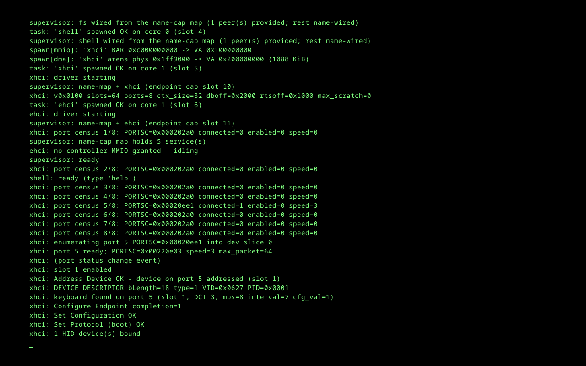
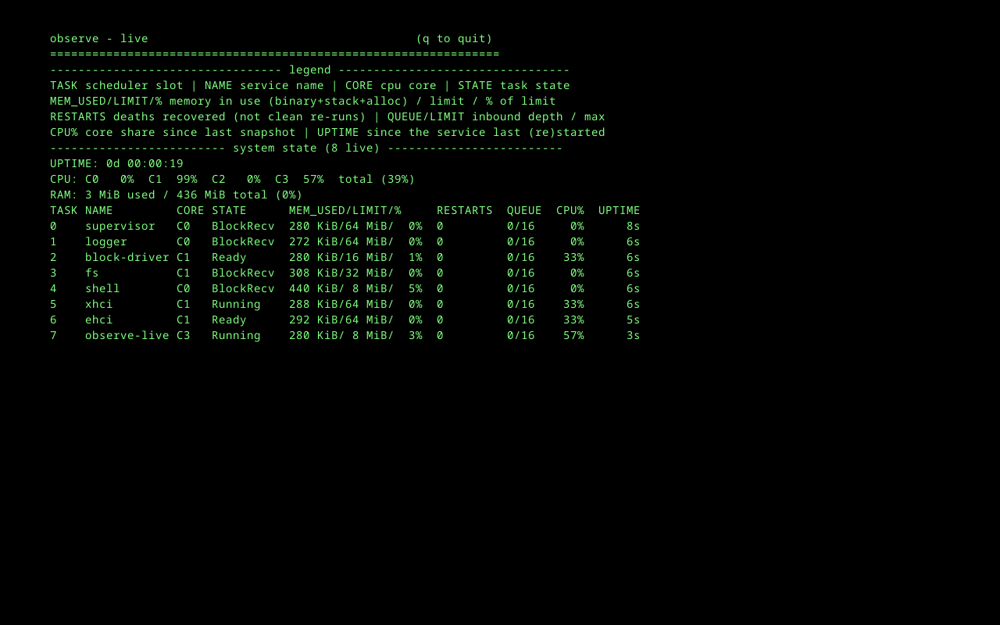
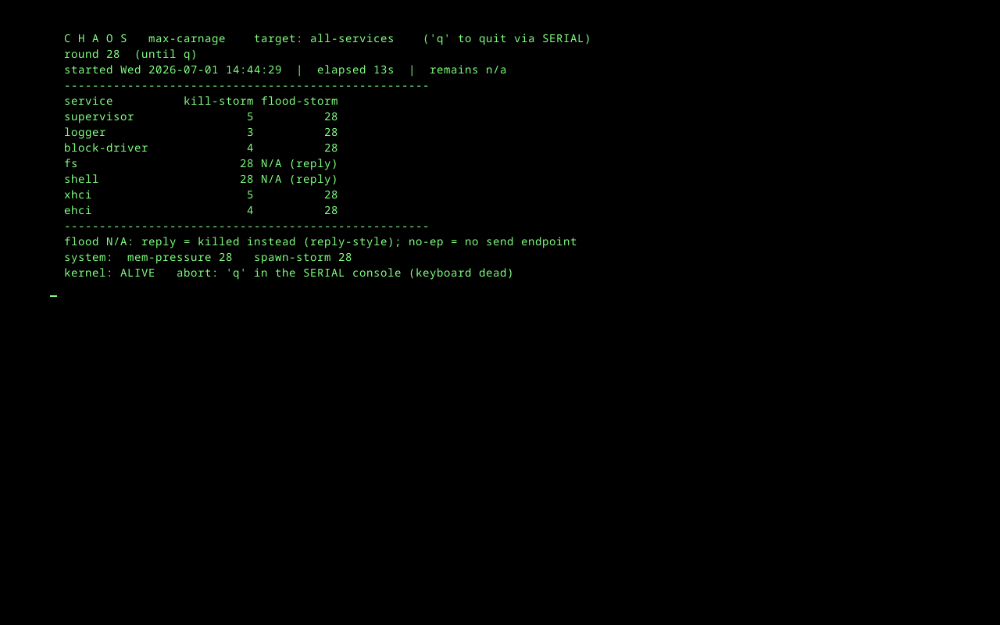

# The System, Running

Every image on this page is a capture of the real GodspeedOS, booted in QEMU with an emulated
framebuffer and photographed straight from the guest's video memory. `website/tools/fb_shot.py`
grabs a single boot frame; `website/tools/fb_capture.py` drives the shell over the COM1 serial line
(where the shell reads input) and screendumps the framebuffer at a chosen state. Nothing here is a
mockup.

## Boot to steady state

The kernel comes up on all cores, spawns the supervisor directly, and the supervisor wires each
service from its name-cap map. Here the USB stack has just enumerated a keyboard end to end, and the
shell is ready. The framebuffer console mirrors the serial log.

## Live introspection: `observe`

`observe` is a live, full-screen view of every service the system is running - scheduler slot,
name, core, state, memory against its contract limit, restart count, IPC queue depth, CPU share, and
uptime. It reads structured per-service state the kernel and supervisor already track; there is no
`/proc` text to parse. Here all eight services are healthy: `supervisor` and `logger` on core 0,
`block-driver`/`fs`/`xhci`/`ehci` spread across cores, the `shell`, and `observe` itself.

## Maximum carnage: `chaos max-carnage`

This is the fire (Commandment II). `chaos max-carnage all-services` storms every live service at
once - kill-storms, queue floods, system-wide memory pressure, and spawn-storms - round after round,
forever, until you abort it. The table counts the punishment each service has taken: by round 28,
`fs` and `shell` have been killed 28 times each (they are reply-style services, torn down every
round), the `supervisor` itself 5 times, the drivers flooded 28 times.

And the line that is the whole point:

> `kernel: ALIVE`

Everything above the kernel dies and is respawned - even the supervisor, which the kernel itself
brings back. Only the kernel is unkillable (Commandments II and V). The abort is deliberately a
serial-console `q`, because the storm will kill the keyboard driver too.

<!--
Next captures to add (each a real run, driven by website/tools/fb_capture.py):
- The gsh> shell prompt with a few commands run (drives, date, ls).
- An edit session in the full-screen editor.
These just need the guest driven to the state before the screendump, exactly as above.
-->
