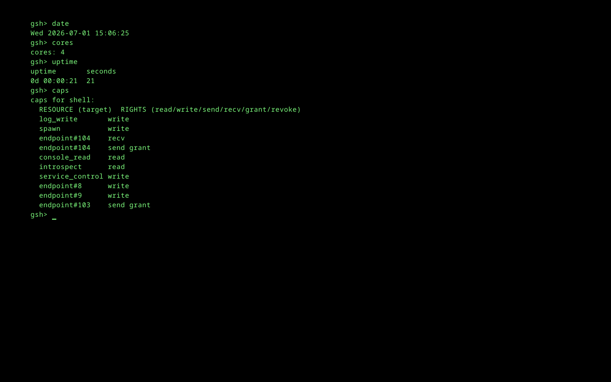
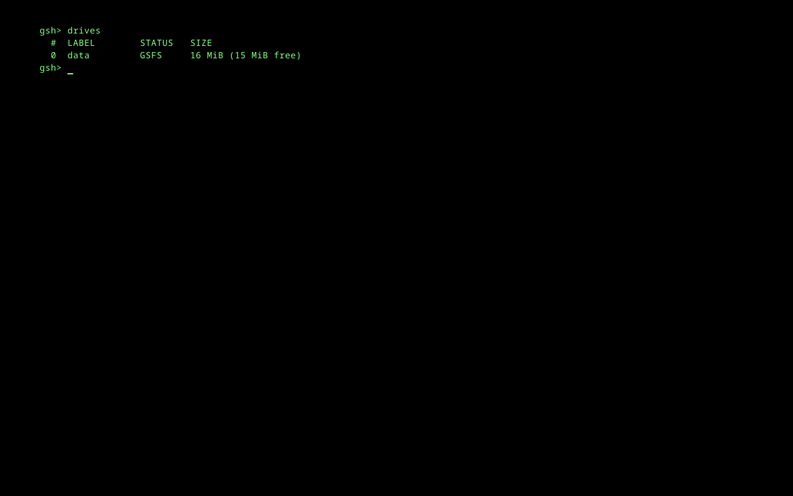
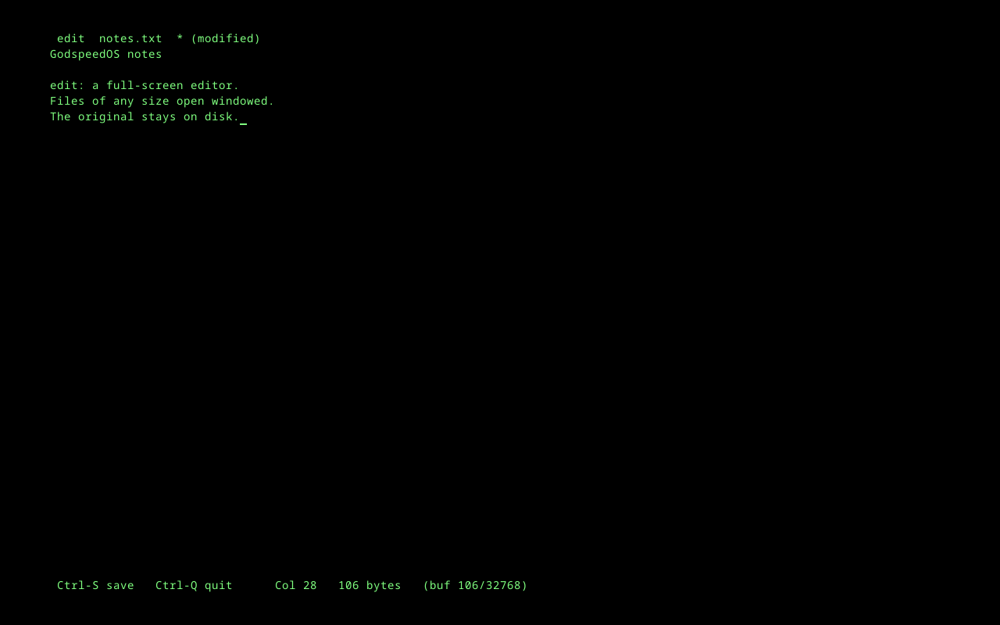

# The System, Running

Every image on this page is a capture of the real GodspeedOS, booted in QEMU with an emulated
framebuffer and photographed straight from the guest's video memory. `website/capture/fb_shot.py`
grabs a single boot frame; `website/capture/fb_capture.py` drives the shell over the COM1 serial line
(where the shell reads input) and screendumps the framebuffer at a chosen state. Nothing here is a
mockup.

## Boot to steady state

The kernel comes up on all cores, spawns the supervisor directly, and the supervisor wires each
service from its name-cap map. Here the USB stack has just enumerated a keyboard end to end, and the
shell is ready. The framebuffer console mirrors the serial log.

## The shell, and exactly what it may do

`gsh` is not a Unix shell - it is a capability-broker service. It holds a console capability and a
handful of others, and it can do precisely what those grant, nothing more. Here it answers `date`,
`cores`, and `uptime`, and then `caps` prints its own capability table: the resource each cap targets
and the rights on it (`log_write`, `spawn`, `console_read`, `introspect`, `service_control`, and its
IPC endpoints). Authority is never ambient or inherited - it is this list, and only this list.

## Live introspection: `observe`

`observe` is a live, full-screen view of every service the system is running - scheduler slot, name,
core, state, memory against its contract limit, restart count, IPC queue depth, CPU share, and
uptime. It reads structured per-service state the kernel and supervisor already track; there is no
`/proc` text to parse. Here all eight services are healthy, spread across the four cores.

## Persistent storage: `drives`

State that must survive a reboot lives on disk, reached only through the `fs` service, which reaches
the disk only through the `block-driver`, which alone holds the hardware capability. `drives` lists
the mounted volumes: one GSFS filesystem, 16 MiB, with its free space. Every byte crossed an IPC
boundary and a capability check to get there - there is no ambient file access anywhere in the system.

## Editing a file: `edit`

`edit` is a full-screen, modeless text editor - a title bar with the filename and a dirty mark, the
text area, and a status bar showing the two keys you need (`^S` save, `^Q` quit), the column, the
byte count, and the edit-buffer fill (`buf 106/32768`). It opens a file of *any* size without loading
it whole: the original stays on disk, read in fixed windows as you scroll, while edits accumulate in
a bounded add-buffer and a save streams the pieces back out. Bounded, no heap, loud when the buffer
fills - never a silent truncation.

## Maximum carnage: `chaos max-carnage`

This is the fire (Commandment II). `chaos max-carnage all-services` storms every live service at
once - kill-storms, queue floods, system-wide memory pressure, and spawn-storms - round after round,
forever, until you abort it. The table counts the punishment each service has taken: by round 28,
`fs` and `shell` have been killed 28 times each (they are reply-style services, torn down every
round), the `supervisor` itself 5 times, the drivers flooded 28 times.

And the line that is the whole point:

> `kernel: ALIVE`

Everything above the kernel dies and is respawned - even the supervisor, which the kernel itself
brings back. Only the kernel is unkillable (Commandments II and V). The abort is deliberately a
serial-console `q`, because the storm will kill the keyboard driver too.

<!--
Next captures to add (each a real run, driven by website/capture/fb_capture.py):
- A gsh script (.gsh) running via `run`.
These just need the guest driven to the state before the screendump, exactly as above.
-->
